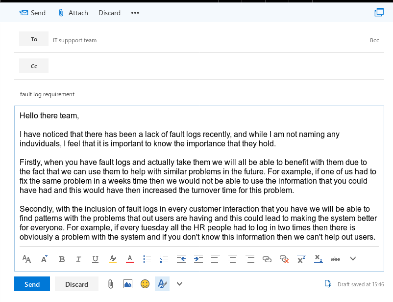

# **Unit 12 - IT technical support**

> Assignment 1 - IT technical support guide 

_Daniel Easteal_

## Contents page 

Introduction - 

P1 - Explain the tools and techniques used for technical support guide 

M1 - Discuss the importance of keeping fault logs 

D1 - Review a recent advance in support systems technology

Conclusion - 

Bibliography - 

## Introduction

In this assignment I will be going through and showing you the need for technical support systems and how they are used, why fault logs are important and a recent advance in system support. 

## P1 - Explain the tools and techniques used for technical support guide 

In this section I will be going through and showing you some tools and techniques that are used for aiding in the process of IT support. For this I will be going through the following tools:

* VNC
* Task manager
* defragmentation 

And the following techniques:

* fault database
* fault logging

### VNC

One of the best tools for remote access and support is NNC, or Virtual Network Computing. This is what is called remote desktop software due to the fact that it allows the user to have their desktop computed remotely controlled by their IT support person. The way that this works is that the user will install software on their machine that will act as a server for the it support technician to connect to, on their end, the IT support technician will just connect to the users computer and this well then ask the used if they want to accept this. Once they accept this the IT technician will be able to remote control the computer in terms of the keyboard and mouse. From here the technician will be able to fix the problem that they have and they can both stay where they are.  

### task manager

One other tool that is available and really quite helpful to IT support technicians is the task manager on windows and top on Linux systems. This is a program that is installed by default on all the systems and allows the user to see exactly what their computer is doing and what process is using what amount of CPU and RAM and this can be used to aid users with their system. As you could imagine, this will often be used along side VNC as it will allow the IT technician to see what the computers is doing. With this the technician can easily fix a computer problem and be able to aid the user. 

### defragmentation

One final tool that can be helpful to technicians is the use of defragmentation software to help with a computer issue. When you store files on a hard drive you will end up deleting and adding files all of the time, and due to this, overtime the hard drive will have files located all over the place and not in the neat arrangement that they should be in. This can then lead to the computer being really slow to do things and could lead to people calling the IT support team about it. The way that the defragmentation software works is that is will move all of the files back to where they should be and this will lead to faster computer performance. 

### fault logging and database

One main techniques that is used for helping the IT support team is keeping a record of all the problems that have been fixed with the system as well as all of the problems they have had. With this database in place the  IT team would be easily able to identify a problem that they have and then be able to fix it really quickly. The way that this works is that when one of your users has a problem, you would log the information about the problem that they are having in the database and then you would look to see if a problem like this has happened before. If it has then you would look up how that problem was fixed. With this set-up you would be able to fix any problem that you have had already and this would lead to a having a huge expert system that you could use to fix any problem in your company. 

## M1 - Discuss the importance of keeping fault logs 

In this section I will be going through and showing the importance of keeping fault logs. For this I will be sending an email to the technical team asking then about the fact that there has not been any taken recently. 

## D1 - Review a recent advance in support systems technology

In this section I will go through and explain a recent advance in IT support systems and what the as well as what the advantages and the limitations of this would be. For this I will be writing about Web filtering systems. 

### Introduction

To start off with I will explain what web filtering is. When you own an organisation or you are the main network / system administrator for that company then you would want to ensure that the people who use the network are using it in a way that is appropriate for the work environment. One way to do this would be to place trust in people but that will not stop certain sites from being accessed, and so a stronger approach may need to be used. There is always the option to block certain ports on the network to disallow the ability of of these websites, however this will have the effect of breaking some websites that are supposed to be accessed and this will cause many more problems that it would solve. This is where web filtering comes in as all of the internet traffic will be scanned and this will then allow only the content that you want to be accessed. An example of a web filtering system would be Lightspeed systems, they are a popular and well respected company that deals with this type of stuff on a day to day basis. 

### Advantages

The main advantage that this has is that it will be one of the first line ways that the downloading and the there for the execution of malicious programs will be reduced. For example lets say that you don't want to have to fix every ones computer from the virus that they can get from download websites, then the best way to do this would be to filter those websites from being accessed by the users. This will then mean that the users cannot go to the websites to download these viruses and as such the system will stay safe and the job of the IT technician will be done. An additional way that this will help is that it will also improve the productivity of the users at work at they will not be able to access sites like facebook or reddit that they could use to waste their time. This can easily be done by filtering out those websites so that they cannot be accessed at all at work. You may think that this is not relevant, but it really is as the job of the IT system admin is to ensure that the network and computer system does not interfere with the productivity of the users, and when you think about it that is exactly what is happening in this case. Finally, it will also free up more time for the IT support staff as they would not have to deal with this. 

### disadvantages

The main disadvantage that you would see with a system like this would be the fact that all of the network activity will have to be monitored and logged and this will require there to be a powerful and main server in place that can handle all of this information as it is flowing through the network. So, for example if you are a small organisation that needs this sort of technology then it may be a big investment for you. Additionally there may also be a failure with the system that would identify a website that is supposed to be accessed as bed and then block it. For example if you had an informational page about programming then this could get flagged up as gaming and then it would be blocked from access. This however would not be such a problem with the recent advance that this support technology has had, and that is machine leasing. With the addition of machine learning, a program would be able to quickly scan a webpage before the user gets it and then it would be able to determine if it contains material that has been defined as unsuitable and as such it will then block it. This is such a good thing as you would no longer have to have tables of allowed and disallowed websites, but instead you would be able to do it all on the fly and in live time. This would greatly improve both accuracy and reliably of the program and would mean that it would work much better. 

## Bibliography

