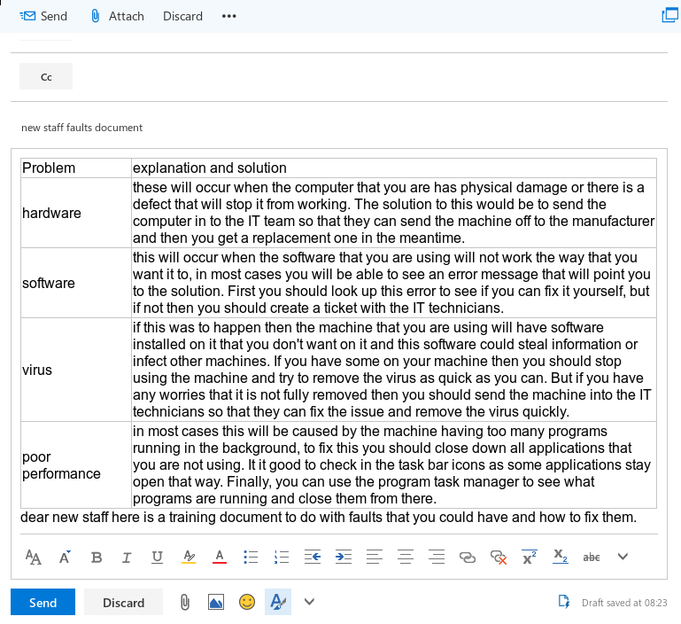

# **Unit 12 - IT Technical Support Guide**

> Assignment 2 - Working Policies and Procedures

_Daniel Easteal_

## Contents page 

Introduction - 

P2 - explain the impact of organisational policies and procedures on the provision of technical support 

P3 - Identify the types of faults that can occur 

M2 - explain the advantages and disadvantages of outsourcing technical support

Conclusion - 

Bibliography - 

## Introduction

In this Assignment I will be going through the working policies that are at work when you are at an organisation in terms of policies in general, faults and outsourcing.

P2 - explain the impact of organisational policies and procedures on the provision of technical support 

For this section I will explain the importance and the need for organisational policies when you are at a company and specifically ones that would effect the IT technical support team. For this I will be writing about the following policies:

* service level agreements
* the working week
* software installation 

### Service Level agreements

To start things off, when you are providing a service to someone or an organisation there is going to be a need to list out all of the things that you will do as part of the service and how much each will cost, what you can and cannot do and so on. This is needed basically any time that these is an agreement going on so that both sides have it all down on paper. When you are offering a service, and most often in business, this is called an SLA or a Service level agreement. Now there are 3 main types of these SLA's and they are:

* serviced based
* customer based
* Multilevel

#### serviced based

These are the main type of SLA that is used in business and is what is often meant when SLA's are mentioned due to the fact that most SLA's will act on many people in a company. The way that these work is that these are provided to many many people from a single company for a single service. For example, if you had a work machine then you might have a serviced based SLA that would dictate how the machine is to be fixed if it experiences a hardware or software fault. There would also probably be something in the SLA about a replacement machine as well.  

#### Customer based 

This is an SLA where a company will have and SLA with one of their customer groups and they will cover all of the services that they use, not just a specific one. For example if you had the finance system for a company set up then you might use a single companies system for everything that the finance people would do from payroll to budgeting and so on.  

#### Multilevel

The final one that there is in this list is the multilevel SLA, this is one that is basically in the middle of the other 2 that I have just mentioned. In this one you would have different levels of SLA for the different customers that you would be servicing. For example a phone company could offer a simple sim only contract to single customers of an organisation but also a full system for the call centre.

As you can see, this would have a huge impact on the IT technicians as this would be something that the team would have to keep an eye on for the users that they are serving. 

### The working week 

Another organisational policy that would effect the IT technical team would be the fact that the working week and open times exist for a workplace environment. What I mean by this is that the workplace may only be open from 9 to 5 and only on weekdays that this could interfere with the plans that they have as computer problems will not follow this time scale. For example, if this is a huge problem that happens with the main server late on a Friday then the issue may not be able to be fixed until the following Monday as the workplace would be closed. This then means that the IT team has to set up methods that still allow them to fix an issue like this if it were to happen at all. This could be setting up remote access to the servers that they have from anywhere that they can use at the weekends, but its something that they will need to keep in mind. 

### Software installation 

One main policy that is often in effect when you are in possession of a work machine is that you cannot install 3rd party onto the machine. This is mainly a good thing in general due to the fact that it will mean the network and machines will stay more secure, but it can impact negatively onto the IT support team. For example, if you needed to install some software on a machine because it was not working then you would have to get the approval to do this, then wait for a response, set up a network install and then have it install in the background of the machine through the next few hours, rather than just going in and installing the software manually and taking 10 minutes to do so. This will have an impact on how the IT technicians will install and plan to install software on the machines that they will need to service. 

## P3 - Identify the types of faults that can occur 

In this section I will go through and explain the types of error that can occur and then send this information off to members of staff about what the solution to these problems are. 

| problem | solution |
|---------|----------|
| hardware | these will occur when the computer that you are has physical damage or there is a defect that will stop it from working. The solution to this would be to send the computer in to the IT team so that they can send the machine off to the manufacturer and then you get a replacement one in the meantime. |
| software | this will occur when the software that you are using will not work the way that you want it to, in most cases you will be able to see an error message that will point you to the solution. First you should look up this error to see if you can fix it yourself, but if not then you should create a ticket with the IT technicians. 
| virus | if this was to happen then the machine that you are using will have software installed on it that you don't want on it and this software could steal information or infect other machines. If you have some on your machine then you should stop using the machine and try to remove the virus as quick as you can. But if you have any worries that it is not fully removed then you should send the machine into the IT technicians so that they can fix the issue and remove the virus quickly. |
| poor performance | in most cases this will be caused by the machine having too many programs running in the background, to fix this you should close down all applications that you are not using. It it good to check in the task bar icons as some applications stay open that way. Finally, you can use the program task manager to see what programs are running and close them from there. |  

## Bibliography

