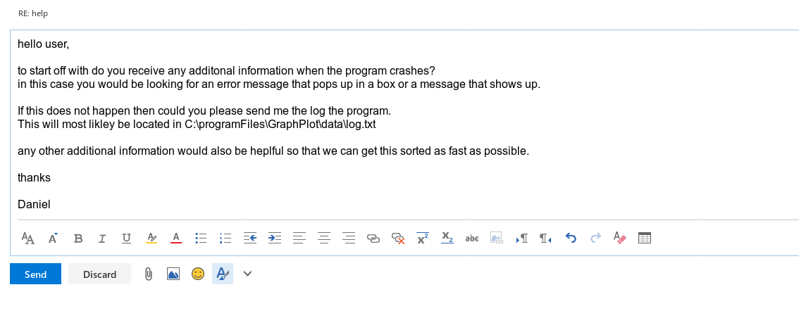
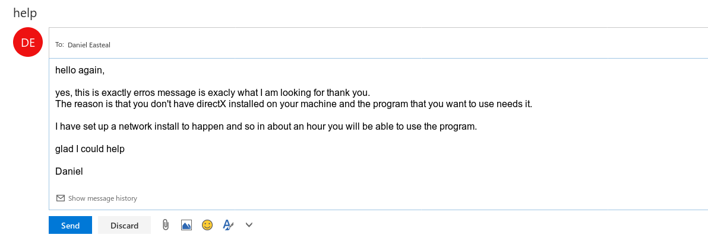

# **Unit 12 - IT technical suppost guide**

> Assignment 3 - Manage and Maintain IT Support

_Daniel Easteal_

## Contents page 

Introduction - 

P4 - Source technical information to provide advice and guidance for a variety of faults
Fault Log

P5 - Use different communication routes to provide advice and guidance 
Report / Fault Log

P6 - Respond appropriately to end users
Questionnaire / 
Survey / Supporting 
Statements

P7 - Check solutions and record actions
Fault Log

M3 - Judge the value of different sources of support material
Fault Log

M4 - Provide additional support material to users
User Guide

D2 - Demonstrate effective communication skills with different types of end user

Conclusion - 

Bibliography - 

## Introduction

In this assignment I will be going through fault logs and technical information as well as communication with the users of a system. 

## P4 - Source technical information to provide advice and guidance for a variety of faults

In this section I will be going through a fault log table and showing how you can solve a fault and how it can be fixed along with the sources of information that I used. 

> |date | fault | solution | sources |
> |-----|-------|----------|----------|
> | 26/05/17 | battery life is low | replace the battery under the manufactures warranty | warranty sheet: https://www.ikt-handel.no/pdf/7009B831-78D1-4FC5-9927-A04CF437E04A.pdf |
> | 13/05/17 | user forgot password | reset the password on the server | fault recordings showing previously found solutions |
> | 23/05/17 | missing windows config file: "missing d3dx9_43.dll" | reinstall DirectX 2013 on the machine | FAQ and technical forums: http://www.tomshardware.co.uk/forum/26050-63-missing-files-windows |
> | 09/05/17 | closing the lid of the laptop would freeze the machine | update the bios of the machine | Manufacturers knowledge base 

## P5 - Use different communication routes to provide advice and guidance 

In this section I will be going through the process that I use to communicate and aid the end user when they are experiencing an issue. For This I will be showing an email conversation that I had with an end user with the missing dll problem in the table above as the email was the communication route that I took.    

## P6 - Respond appropriately to end users

## P7 - Check solutions and record actions

In this section I will show the way that I recorded down the information that was to go into the fault log in full for the issue that the custom we just saw had. The reason is that the fault log above is a short hand version in a table format.

> ### date
> 23/05/17
> ### fault
> The user was unable to open the software "GraphPlot" as every time they did the software would crash to the desktop. After some searching it was found that an error message containing the text "missing d3dx9_43.dll" was showing up for a small amount of time. 
> ### Solution 
> the "missing d3dx9_43.dll" error refered to the fact that this machine was missing its installation for the 2013 Microsoft DirectX software. The appropriate software was located and verified to fix this issue and then it was remotely installed onto the computer via the network over the next 30 minutes to an hour. 
> ### sources
> after not knowing the answer myself I immediately asked my colleague weather they knew the answer, they mostly did as the know that this was from a missing Microsoft framework but was not sure what one is was. From here I then looked it up online and got many, many answers all pointing to the same software to install (DirectX 2013). The site that I used was: https://answers.microsoft.com/en-us/windows/forum/windows_7-windows_install/missing-d3dx943dll-file-wont-allow-me-to-install/dddd4657-9ebe-4340-9122-3cab10dfad44 {see appendix a}

## M3 - Judge the value of different sources of support material

As you can see at the end of the fault log that you just saw, there is an appendix that is attached to the end that will show the other placer where the same information can be accessed if for some reason the main one that was in the log was not available. The appendix a looks like this:

> {appendix a}
> https://boards.na.leagueoflegends.com/en/c/help-support/KhJY49i3-missing-d3dx9-43dll 
> http://www.ihaveapc.com/2010/11/how-to-fix-d3dx9_43-dll-missing-error-in-windows-7/ 
> https://answers.microsoft.com/en-us/windows/forum/windows_7-windows_install/missing-d3dx943dll-file-wont-allow-me-to-install/dddd4657-9ebe-4340-9122-3cab10dfad44 

I will now go on to write about these sources of information and compare how good they actually are to ensure that I am getting the best information that I can. As you can initially see, there are 3 sites that are listed here at the end of the log, this is already good as it shows that the information that I have is the actual information I need and that it is actually correct. The reason that I can say this is due to the fact that the if the information was not true and this method did not fix the problem, then it would not be so readily available and in multiple locations on the internet.  

### legitimacy 

One of the main things that you should keep in mind when you are looking for information about how to fix a computer problem is the legitimacy of the website that you are using. By this I mean that it is a website that will actually give you the correct information and is trusted. For example, if you get the information that you use from microsoft.com then you can be sure that the information will be accurate and will actually fix your computer. But if you were to go to freeDownloadSoftware.com and download a program from there, then there would be a lower level of trust with that website. In the examples that I have provided you can see that the final one ( the one I actually mainly used ) is from a legitimate website and that the others are from lesser known websites. Just from this you would think that this would instantly fix your computer with nothing else to worry about, and you would be right due to the website the information is on.  

### cross reference 

One of the most important things that you can do when looking up information like this, is to ensure that the information that you have is actually the correct information, and the best way to do that is to cross reference your information. The way that this works is that when you find information on one site you would then go to find the same information in other locations to verify that the information is correct. For example, if you go to a website tdat is not the best then instead of fixing your problem then you could find out that what they told you to do would actually damage your machine more than it would fix it. There for you know that if you look around and then find that same information on many, many other sites then that information has a really low chance of being bad. And as you can see from the appendix, I have done this. 

Overall I would say that the 3rd one is the most reliable source use to follow since it is from the people who actually made the problem. 

## M4 - Provide additional support material to users

In this section I will go through and create a simple guides that will go through common faults that people may have with a computer and how they can be fixed easily with images to show the process.

### computer is slow to start up

One of the main reasons that the computer may be slow to start up would be that the computer is starting too many programs and processes when it starts up and as such is need to let them run and this will slow everything down. 

If you are running windows then you can open up the start-up tool to control what programs the computer will run on start-up.

To start this process, log into your computer and then search for "msconfig.exe" like you see here:

Now just launch the program that you see there and you will see a new window pop up. All that you need to do now is move over to the Startup tab, you should now see something like this:

From here, all that you would do is that you would click the button to disable all of the programs that you don't want to run when you start-up your machine. This will then mean that your machine will boot up faster. 

### 404 error when you access web pages

Another common problem that people face is that when you try to access any website you get the 404 error instead, now this can be caused by many things. The first thing that you should do is that you should ensure that you are connected to wifi but if you are not then you may have a dns problem, but don't worry its really easy to fix. To start off with you will need to do is right click on the networking icon in your task bar and then select "Open network and sharing centre" 

Then you will want to click the text that says "change adaptor settings on the left hand side:

Then right click your network interface that you want to change (wireless for a laptop and wired for a desktop), and click on properties:

Then scroll down and select the Internet protocol version 4 as you can see here:

Finally, select set my own address and then put in 8.8.8.8 like this:

D2 - Demonstrate effective communication skills with different types of end user

In this section I will be going through and showing that I am able to effectively communicate with the user in a way that was appropriate for them, either explaining it simply or explaining it complexly. I will demonstrate this through the use of a questionnaire that would be attached to the fault log. Here is the questinarre that would be sent out to the customer:

> Hello, you recently had a problem of yours fixed with the IT technical team, we were just wondering 
> if you could take a moment to fill out this questionnaire about your experience. 
> How well was the guidance was presented to you with your issue?
>
> 1  2  3  4  5  6  7  8  9  10
> 
> Please elaborate and explain why?
>
>
>
> How well was important information communicated to you about your problem?
>
> 1  2  3  4  5  6  7  8  9  10
>
> Please elaborate and explain why?
>
>
>
> How well did the technician handle the situation?
>
> 1  2  3  4  5  6  7  8  9  10
>
> Please elaborate and explain why?
>
>
>
> Any other suggestions or improvements?
>
>
>
The results from this would then go into the fault log along with some additional information about the problem, so the full fault log would look like this:

> ### date
> 23/05/17
> ### fault
> The user was unable to open the software "GraphPlot" as every time they did the software would crash to the desktop. After some searching it was found that an error message containing the text "missing d3dx9_43.dll" was showing up for a small amount of time. 
> ### Solution 
> the "missing d3dx9_43.dll" error refered to the fact that this machine was missing its installation for the 2013 Microsoft DirectX software. The appropriate software was located and verified to fix this issue and then it was remotely installed onto the computer via the network over the next 30 minutes to an hour. 
> ### sources
> after not knowing the answer myself I immediately asked my colleague weather they knew the answer, they mostly did as the know that this was from a missing Microsoft framework but was not sure what one is was. From here I then looked it up online and got many, many answers all pointing to the same software to install (DirectX 2013). The site that I used was: https://answers.microsoft.com/en-us/windows/forum/windows_7-windows_install/missing-d3dx943dll-file-wont-allow-me-to-install/dddd4657-9ebe-4340-9122-3cab10dfad44 {see appendix a}
> ### customer technical ability
> novice 
> ### questionnaire answers 
> How well was the guidance was presented to you with your issue?
>
> 1  2  3  4  5  6  7  [8]  9  10
> 
> Please elaborate and explain why?
>
> guidance was presented quite well to me, I was told what the problem was
> and how it was fixed, but not how to fix similar issues.
>
> How well was important information communicated to you about your problem?
>
> 1  2  3  4  5  6  7  8  [9]  10
>
> Please elaborate and explain why?
>
> I knew exactly what I had to do in the process and even though I didn't 
> know anything about this before.
>
> How well did the technician handle the situation?
>
> 1  2  3  4  5  6  7  8  [9]  10
>
> Please elaborate and explain why?
>
> they were really nice with the whole situation and got it sorted with 
> no fuss at all. 
>
> Any other suggestions or improvements?
>
> maybe let people know how to fix similar issues in the future. 
> ### {appendix a}
> https://boards.na.leagueoflegends.com/en/c/help-support/KhJY49i3-missing-d3dx9-43dll 
>
> http://www.ihaveapc.com/2010/11/how-to-fix-d3dx9_43-dll-missing-error-in-windows-7/ 
>
> https://answers.microsoft.com/en-us/windows/forum/windows_7-windows_install/missing-d3dx943dll-file-wont-allow-me-to-install/dddd4657-9ebe-4340-9122-3cab10dfad44 

## Bibliography

