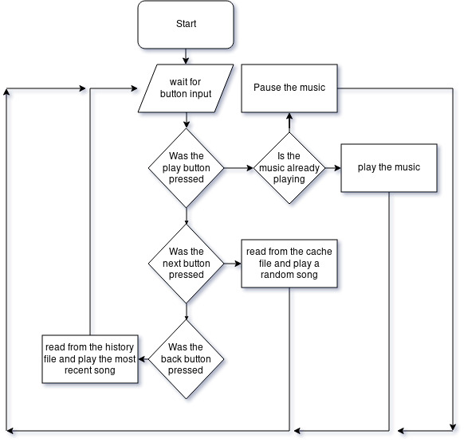

# **Unit 14 - Event Driven Programming**

> Assignment 2 - Design Work 

_Daniel Easteal_

<div style="page-break-after: always;"></div>

## Contents page 

Introduction - 

P3 - Design and event driven application to meet defined requirements

M2 - Give reasons for the tools and techniques used in the production of an event driven application 

Conclusion - 

Bibliography - 

<div style="page-break-after: always;"></div>

## Introduction

In this assignment I will be going through the production and the design of small, event driven program along with how it will work and how I apply the techniques that I use. 

## P3 - Design and event driven application to meet defined requirements

For this section I will be going through the ideas of the program all the way through to the pseudo code that the program will run. 

### introduction and purpose

To start off with, the idea of the program is that it will be an application for music playback that you would only need to use the keyboard for. The way that this would work is that if you wanted to change the music that you are listening to then you would alt-tab to the program and you would then be able to press certain keys that you have configured to play/pause, skip...etc... The music that is playing on your system, in addition to this the program would also accept input from when it is not running and focused by using the function keys in addition to the normal keys that you have set, this will mean that you can control the program all the time no matter where you are on the system. 

### Show tools and techniques used

In this sub section I will be going through the tools that I used for this program as well as how I used them. This list will therefore contain information on the following things:
selection, loops, event handlers, triggers, menus, variables and their scopes. 

#### selection

When programming there is a need to have selection so that the program can selection between things and decide what so the best thing that it needs to do with the given inputs. This will mainly show up in the form of if statements and there will be a lot in this program. One example of this would be in the main loop once the program detects that the program is playing music. What will happen in that the play function is actually a toggle that will play the music if paused and pause the music if it is playing. An example of some code would be as follows:

```c
if ( musicStatus == 'Playing' ) {
	musicControl(Pause);
	musicPlaying = 0;
} else {
	musicControl(Play);
	musicPlaying = 1;
}
```

As you can see, in this example there is a selection in the form of an if statement that will play the music if it is not playing and will pause the music if it is playing. This is now a toggle for the music playing. 

#### loops

In similar way to selection, loops are a main way to control the flow and logic of a program that will repeat a section of code while a certain condition is true or for a certain number of times. In my code there will be a lot of loops but one of the main loops will be the main loop that is used for the program to run and I call this the main loop. The function of this loop is to ensure that the program will carry on running when in the background and the whole program will be inside of it, it will look like this:

```c
while ( mainLoop == 1 ) {
	...
}
```

With this loop in place the program will carry on to run until the variable mail loop is set to 0 and this will be done by pressing the x button in the top corner of the program. 

#### Event handlers

Event handlers are a main and nectary function for all OOP programs as this is the part of the code that will take the key inputs from the keyboard and send them to the program. This is special however, as it is in its own small function so that the inputs re detected as quickly as they can be and the program logic does not get in the way of the inputs. An example of this would be: 

```c
char EventHandler () 
{
	while ( 1 == 1 ) {
		c = getchar();
		keyInput(c);
	}
}
```

As you can see in this section of code, it in its own function and will keep getting characters from the keyboard and send then to the keyInput function that will then intemperate them into the actual main function. 

#### triggers

Triggers are section in the code that act like and if statement but will do an action when a certain vague criteria is met, the can be thought of as a type of if function. One example of this would be in the keyInput function that was mentioned in the previous section. What could happen, is that when the key input into the program is <space> then the program would play or pause the music, this would therefore be the trigger to toggle the music and it could look like this:

```c
	...
	} else if ( c == ' ' ) {
		if ( musicStatus == 'Playing' ) {
			musicControl(Pause);
			musicPlaying = 0;
		} else {
			musicControl(Play);
			musicPlaying = 1;
		}
	}
	...

```

#### Objects and object properties

When you are programming in an OOP language then you will need to have objects and all of those will need to have properties that will determine ho they function and what they can do. In this program there are not many objects due to the fact that it is a very simple program, but some of the objects will be the buttons that are on the front of the music player program. These will be objects as they will all have a similar function and can be interacted with at any time during the program run time. Also, these will have to have properties that will dictate how they behave and these can be inherited from other templates in the program, here is an example of what it could look like: 

```c
object playButton ( int status )
{
	inherit button;
	if ( status == "0" ) {
		display.image(Paused.jup);
	} else {
		display.image(Playing.jup);
	}
}
```

#### menus

When programming you will be using an IDE in most cases that will have menus with helpful menus and tools, but I am not using such an IDE and so there are no menus to show .

#### debugging tools

Again, similar to the last section, normally you would use these to help with the programming section, but I have not used this. 

#### Variables

In this section I will show some of the variables that I have used in this program along with what scopes are, what constants are and what data types are. 

##### declaring variables

When you are programming there is a need to manage spaces in RAM that you can give names to control the value that they contain and read fro them later on. But in order to do this you will need to have told the program what memory you want set aside and then what that will be called by, this is done by declaring the variable. Here are a few examples:

```c
int status = 0;
const char musicStaus = 'Paused';
```

In this example you can see that there have been two variables declared and set up, the first few words indicate the data type which is basically the size in memory that should be set aside for the data that it is gong to be store. Next there is the name and in this example the names are "status" and "musicStatus", these are used to refer back to the space in memory so that it can be read and written to. Finally at the end there is the value that the variable will be set to initially and in this example that is the number 0 and the string of "Paused". 

##### scope of variables

When you are programming there will be different scopes that variable can be created in and as such they can only be accessed in the certain scopes they they are created in. For example, if you were to create a variable in a certain function, then that variable would only be able to be accessed in that function. This therefore has the side effect that you can have variables that have the same name in the program but because they are in different scopes then they are not the same variable and point to different information. One example of this could be a variable called "i" that would only be used when you are counting the loops of a for loop, this can then be used in many different loops all over the program so that you know that "i" just counts that loop. Here is an example of this:

```c
	...
	int i;
	for ( i = 0; i < 100; i++ ) {
		...
	}
	...
```

##### Constants

Variables are just a section in memory that has a name and that you can read to and write from in a way constants are basically just the same its just that they can only be read from, not written to. It means that they have a constant value and never change. There are many ways to do this in may different programming languages, but one example is below:

```c
#define MAX_HEIGHT 127
```

In this example the text MAX_HEIGHT now represents the number 127, and that cannot be changed during the running of the program. This is great as it means that you can set a global max height for something and easily change it when you need to when creating the program and then all section of the code will follow that global rule. 

#### Data types

As mentioned before, there are many different data types that variables can take and the reason that they exist is so that the program can allocate the memory that it needs the most effectively so that not too much memory is taken and so that not too little memory is taken. In addition to this the data types also help keep the formatting of the data that you store correct so that it will be of a valid format. Below is a small summary of the some of the man data types that exist:


### Show examples of triggers used 

In this section I will go through some examples of the triggers that I have used in this program. As mentioned, triggers are parts in a program that are used to active something once a certain criteria has been met. These are mainly used for user input rather than just internal logic and thats how they are mainly differentiated between. In my program there are a few different triggers that are used and these are when the user presses a button and when they click on the buttons on the screen. The button down will detect when the user presses a button on their keyboard and that will then be sent through to the program and the screen click will register when the user clicks the icons on the program. Here is some example of the code:

```c
...
	if ( play.buttonClicked == 1 ) {
		if ( musicStatus == 'Playing' ) {
			musicControl(Pause);
			musicPlaying = 0;
		} else {
			musicControl(Play);
			musicPlaying = 1;
		}
	}
...

...
	if ( play.keyPress == 1 ) {
		if ( musicStatus == 'Playing' ) {
			musicControl(Pause);
			musicPlaying = 0;
		} else {
			musicControl(Play);
			musicPlaying = 1;
		}
	}
...
```

### Indicate all properties to be assigned to screen components

In this section I will briefly go through the properties that will be assigned to the screen components. In my program there will be a very simple user interface which will be a screen with a 3 buttons to keep the I very clean and simple. Due to this there will not be many screen elements as there will only be the 3 buttons. The 3 buttons that I will have are the play/Pause, forward and back buttons. The play pause button will be a simple sprite that will show the play button when the music is paused and the pause button when the music is playing, the background will also change to show the button as being pressed or not. The other two buttons will be for going to the next or the previous song on the computer. Due to this layout that I have there will only be one main screen component and that will be the main box for the screen and then the components that go on it will be the 3 sprites for the buttons. 

### Create 3 draft designs 

In this section, I will go through and show 3 designs that I had for the software in terms of what it would look like, all of these will be annotated to show you what they mean. I also have chosen the last one for my final design for the program. 

### Test plan

When you create a program it is very important to test the software to ensure that it all actually works as you intended it to and the main way that this is done is though the creation of a test plan that goes through the steps that you will take to test the software when it has been created. For the software that I am creating there is not much that I need to test and due to this there will only be a small test plan as there is not too much advanced functionality that I need to test. Below you will see the list of the things that I will need to test:

* does the software display on the screen
* does it scan the folder correctly
* does the play button play the music
* does the play button change sprite
* does the music stop when play is pressed again
* the music will skip fully to the next song when one has ended
* the next song button will skip to the next song
* the back song button will skip back a song
* there will not be any unexpected crashes

With all of these in the test plan the application can be tested to see if it will actually work as I want it to and asses how well the application runs and performs. If any of there steps do not work out then I will have to go through to that section of the code and see if I can fix the problem. 

### Algorithm and pseudo code 

Here I will go trough the logic that lies in the program so that you can see how it actually will end up working behind the scenes. First there will be the algorithm of the program:

> create the window 
> display the window
> if there is a cache database of the music then:
> + read the music from the cache to get the file paths to play
> - display the music directory screen and let the user select the path for the music that they want to play
> - scan through the directory and note any music files that are in them in the cache
> wait for a user input of the button
> when a button is pressed then do the following action:
> > if the play button / play key combination is pressed then:
> > + check if the music is playing and if it is then pause the music 
> > - if the music is paused then play the music 
> > if the forward button is pressed then:
> > + set the currently playing song to random other in the list
> > if the back button is pressed then:
> > + go back to the beginning of the song but if the button is pressed another time in the next second then:
> > > + set the currently playing song to the one that was just playing
> if the song comes to end then:
> + set the currently playing song to random other in the list
> keep looping until the program is is told to close

And here will be my pseudo code for the program: 

```c
int main()
{
	window.create("player", 100px, 50px, bg:white);
	window.show.player(playButtonPause.png, 50, 50);
	window.show.player(backButtonPause.png, 25, 50);
	window.show.Player(forwardButtonPause.png, 75, 50);
	if ( exists(~/.musicPlayer/cache) == 0 ) {
		window.create("file", 100px, 50px, bg:white, type:file_sys);
		window.show.file("Please enter the directory of the music that you want to play");
		const char dir = window.file.input();
		ls -r | grep .mp3, .wav, > ~./music/cache
	}
	while ( program.status == 1 ) {
		inp = wait.button.press();
		musicStatus = 'paused';
		if ( inp == "play/pause" ) {
			if ( musicStatus == 'playing' ) {
				window.show.player(playButtonPause.png, 50, 50);
				musicControl(Pause);
				musicStatus = 'paused';
			} else {
				window.show.player(playButtonPlay.png, 50, 50);
				musicControl(Play);
				musicStatus = "playing"
		}
		if ( inp == "forward" ) {
			window.show.player(forwardButtonPause.png, 50, 50);
			sleep(0.1);
			window.show.player(forwardButtonPause.png, 50, 50);
			musicControl(next);
		}
		if ( inp == "back" ) {
			window.show.player(backButtonPause.png, 50, 50);
			sleep(0.1);
			window.show.player(backButtonPause.png, 50, 50);
			musicControl(back);
		}
		if ( song.timeRemaining == 0 ) {
			musicControl(Next);
		}
	}
}

void musicControl ( char const state )
{
	if ( state == 'Play' ) {
		song = rand.int(0,lines(~/.music/cache));
		mp3.decode(~/.music/cache[song]);
	}
	if ( state == 'pause' ) {
		mp3.decode(pause);
	}
	if ( state == 'forward' ) {
		mp3.decode(stop);
		cat $(~/.music/cache[song]) > ~./music/hist;
		song = rand.int(0,lines(~/.music/cache));
		mp3.decode(~/.music/cache[song]);
	}
	if ( state == 'back' ) {
		mp3.decode(stop);
		mp3.decode(~/.music/cache[song]);
		time = 1;
		sleep(1)&
		if ( sleep < 0 ) {
			mp3.decode(~/.music/hist[0]);
			removeline(~/.music/hist,[0]);
		}
	}
}
```

### Flowchart

Here you will see a flowchart for the program so that you can follow the logic and see how it works 



## M2 -  Give reasons for the tools and techniques used in the production of an event driven application

 In this section I will be going through the different tools that exist to aid with the production and creation of event driven programming that I used as well as the inbuilt ways of programming. To start off with I will have to write about the main inbuilt thing that is in all event driven programming and that is the use of objects

### Objects

 In event driven programming objects are the name that is given to a type of entity that has certain features that can be an instance of another section of code. By this I mean that objects are basically just sections of other code that take some values from templates that are created but then also change some things so that they are their own thing and are different in the program. A good example would be you could have an object of a football in a game that would take lots of information from the ball template but would have some differences, like its texture or its size. This is a really good thing to have as it means that you don't have to write as much code as you can just copy some code that you have already written to another section. In addition to this it also allows for the executing of code in multiple threads eases due to the fact that the objects cant directly effect something else in the program and so they can have a greater performance. In addition to this, the way that the program is done allows the code of the program to go all over the place allowing for there to be code that does not execute one after another and so much more abstract tasks can be done with objects. The reason that I chose to go with this is that for the assignment I had to do an event driven program and so objects are a main part of that. In addition to this I also chose to use the objects as I wanted to experiment and try out the objects as I don't normally do that. 

### Triggers

 One of the other main things that is used in event driven programming is a trigger. A trigger is a part of the code that will trigger an event or for something to happen when a certain criteria is met. Now this may sound like the definition of an if function, as it basically is but the main difference is that the trigger is used when you want to detect user inputs rather than just detecting logic within a program. Due to this, triggers are used for mouse or keyboard events and they will then in most cases run a function that will interact with the main loop in some way. The reason that this is done is so that all of the processing of the user input can be done in the event handler as this will mean that the inputs will be registered ( but I will write about that soon ). The reason that I used the triggers rather than normal user input into a terminal was all down to the fact that I wanted the program to be easy to use and run in the background without the need to type in commands as then it would not be easy to use. If you look into the pseudo code then you will see that I have triggers set up on the button clicks that will run the musicControl function to then actually do stuff to the music. 

### Variables

 When you are talking about programming and the features that they have that allow you to program well, one of the first things that comes to mind is the use of variables to produce code, and this is still important in the event driven side of programming. Variables are sections in memory that have a name and you are then able to modify or read from in the program to do computation. When you create a variable you will then send a request to the kernel of the operating system and that will then reserve a section in memory for you and pass the location of that back to the program. This is why data types for variables are important, as when you select a data type they will all have to reserve a different size of memory for the program and this will then mean that if you don't have the correct size then you will not be able to store every thing that you need in that space or you will be using memory that you don't need and you will just be wasting resources. I used these in my program as without them actually programming anything would have been very difficult and it would not have been as easy to write for me, and would have taken a lot longer. For example, in the pseudo code that you can see above you can see that I have a few variables that are there like "musicStasus", or "inp" and without these and a few others the program would not have worked.  

### Debugging

Another thing that will come up when you are programming is the fact that you will not program the software that you want to first time with no mistakes, due to this you will need to go through you your code and see what the problem was based on the error that you get when you try to compile it. This will then lead to you having to debug your code to try and fix it, but this is something that is actually easer to do with modern programming.The main way that this is is because when you get an error in your code you will get information on exactly where the problem is and why there was a problem, and with this you can easily get to the solution to fix your code. In addition to this, most IDE's for programming actually include a debugging tool or the language that the IDE is made for, in most cases this will show exactly what the program is using in terms of system resources  and what processes it is using. 

<div style="page-break-after: always;"></div>

## Bibliography

