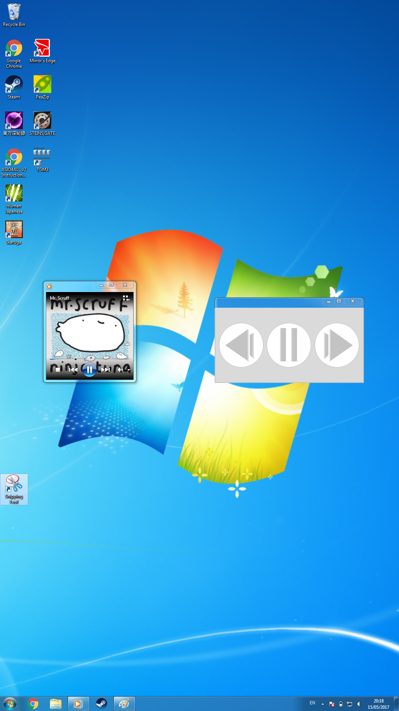
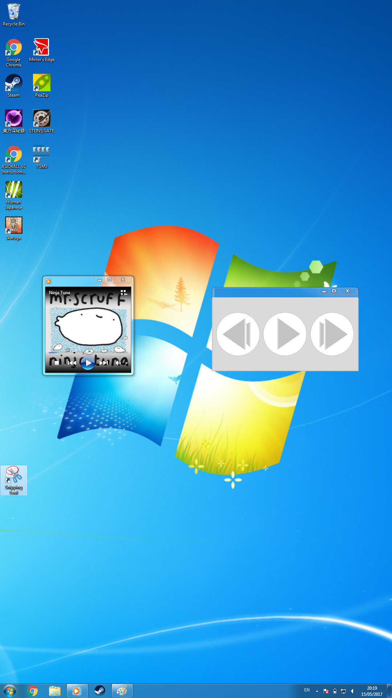
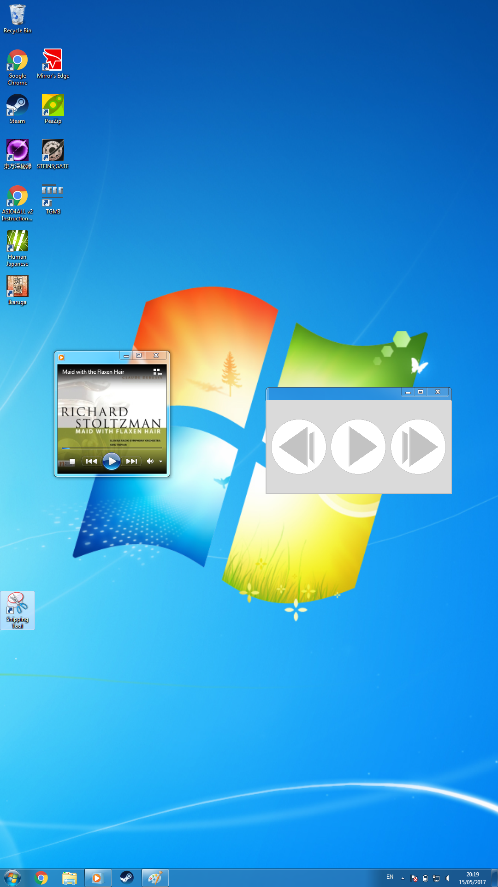
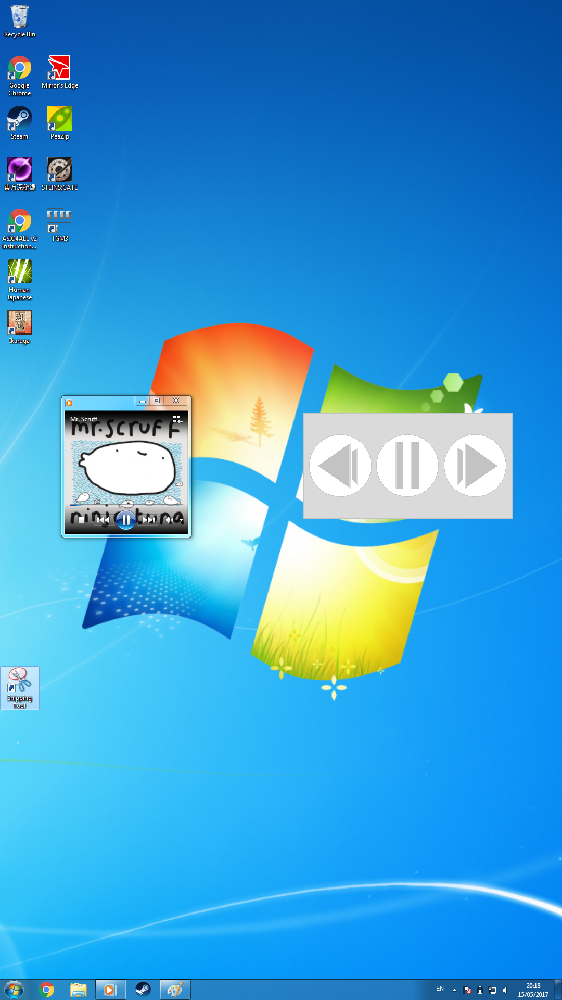

# **Unit 14 - Event driven programming**

> Assignment 3 - Implememtation and test

_Daniel Easteal_

<div style="page-break-after: always;"></div>

## Contents page 

Introduction - 

P4 - implement a working event driven application to meet defied requirements

P5 - test an event driven application 

M3 - analyse actual test results against expected results to identify discrepancies 

D2 - evaluate an event driven application

Conclusion - 

Bibliography - 

<div style="page-break-after: always;"></div>

## Introduction

In this assignment I will be going through the implementation, testing and the analysis of the program that I have created in the other parts of this assignment. I will be going through and actually making the program work and explaining it, then going through and testing the program to see that it actually works, next I will then analyse the test results to see that it actually works and finally I will evaluate the program about how well it it works and compared against what I wanted it to do. 

## P4 - implement a working event driven application to meet defied requirements

In this section I will show the application that I have created with the screen shots showing that it works along with a step by step guide about how I created it. 

### implementation screenshots

In this subsection I will show you the code of the program so that you can see how it all works and how it was implemented, here is the code:


```c
import <sdl.h>
import <Window.h>
int main() 			// the begining of the main function 
{
	window.create("player", 100px, 50px, bg:white);   	// this and the next few lines name and 
	window.show.player(playButtonPause.png, 50, 50); 	// create the windows to be used
	window.show.player(backButtonPause.png, 25, 50); 	// as well as add in the buttons
	window.show.Player(forwardButtonPause.png, 75, 50);
	if ( exists(~/.musicPlayer/cache) == 0 ) {  		// this will check if the cache file exists
		window.create("file", 100px, 50px, bg:white, type:file_sys);
		window.show.file("Please enter the directory of the music that you want to play");
		const char dir = window.file.input(); 		// if the file is not there then it will add
		ls -r | grep .mp3, .wav, > ~./music/cache // all of the music in the system in to the file
	}
	musicStatus = 'paused';
	while ( program.status == 1 ) {  	// this will keep the program running while it needs to
		inp = wait.button.press(); 		// read the user input from a button
		if ( inp == "play/pause" ) {
			if ( musicStatus == 'playing' ) {  	// if the music is playing then pause it
				window.show.player(playButtonPause.png, 50, 50);
				musicControl(Pause); 	// run a function to pause the music
				musicStatus = 'paused'; // set the correct image and the correct variables
			} else { 		// if the music it not playing then do this
				window.show.player(playButtonPlay.png, 50, 50);
				musicControl(Play); 	// run a function to play the music
				musicStatus = "playing" // set the correct image and variable
		}
		if ( inp == "forward" ) { 	// if the forward button was pressed then do this
			window.show.player(forwardButtonPausePress.png, 50, 50); //set the image 
			musicControl(next); // actually moves the song to the next one
			sleep(0.1); 	// wait to that the press animation will show
			window.show.player(forwardButtonPause.png, 50, 50);
		}
		if ( inp == "back" ) {  	// if the back button is pressed then to this
			window.show.player(backButtonPausePress.png, 50, 50);
			musicControl(back); // play the previous song
			sleep(0.1); 	// wait to that the press animation will show
			window.show.player(backButtonPause.png, 50, 50);
		}
		if ( song.timeRemaining == 0 ) {
			musicControl(Next); 	// if the song has stoppes playing then move to the next one
		}
	}
}

void musicControl ( char const state ) 	// the music constol function 
{
	if ( state == 'Play' ) { 	// if you want the music to play then do this
		song = rand.int(0,lines(~/.music/cache)); 	// set the song to a random file
		mp3.decode(~/.music/cache[song]); 	// decode the music file and play it 
	}
	if ( state == 'pause' ) { 	// if you want to pause the music then do this
		mp3.decode(pause); 	// pause the playback of the music temporarly
	}
	if ( state == 'next' ) { 	// if you want to play the next song then do this
		cat $(~/.music/cache[song]) > ~./music/hist; 	// write the current song to the hist file
		musicControl(Play);  	// play the next song
	}
	if ( state == 'back' ) { 	// if you want to go back then run this
		mp3.decode(stop);  // stop the music playback
		mp3.decode(~/.music/cache[song]); //replay the current song from the begining
		time = 1;
		sleep(1)&
		if ( sleep < 0 ) { 	// if you press the button fast then do this 
			mp3.decode(~/.music/hist[0]);  //play the most recent song
			removeline(~/.music/hist,[0]); // remove it from the list
		}
	}
}
```

### Program screenshots

In this section you will see the screenshots of the program and see that it actually ends up working:



In this screenshot you can see the program up and running on windows 7. Most pictures will be in the next section where I test the program.

### Documentation

In this section I will go through and explain the program in terms of how it works and then how the program was created. 

To start off with this is a small and simple music program that will work with the inbuilt music player to play and control any music that you have on your system that you would like to play and listen to. The program is designed to be minimal and as such the user interface is as little as there needs to be so that it is not complicated to use. The basic way that it works is that the program will allow you to pause and play the music that you have on your system when you push the main pause/play button in the middle. If the music is playing then the button will stop the music from playing and if the music is not playing then the button will play the music again. In addition to this the other two buttons change the song that you are listening to, if you press the forward button then the music player will change the song that is playing and play another random song that you have on your machine. But if you press the back button then you will go back to the beginning of the song that you are listening to and it will play from the start, but if you press the button again within a second then it will play the song that you listened to before that.

## P5 - test an event driven application

In this section I will go through and test the program to make sure that it works as I wanted it to and that there are no flaws with how I have programmed it. The format will be a testing table to start will that contains the tests that the expected out comes and then the picture that relates to that test labelled so that you can see what is happening. 

test | expected outcome | picture
-----|------------------|--------
does it actually display | the music player will be shown on the screen | 1
does the play \ pause button play music | the music will be playing | 2
does the play \ pause button pause music | the music will be paused | 3
does the next button actually play the next song when pressed | the song changes to the next one | 4
Does the previous button actually go back a song when pressed | The song changes back one | 5

Image 1:



Image 2:


Image 3:


Image 4:



Image 5:


## M3 - analyse actual test results against expected results to identify discrepancies 

In this section I will be going through the test results that I have just gathered and analyse them and potentially fix the program if it is needed. 

For this I will create a table that will show the results of the testing and what I would then need to do to fix any potential errors that arise:

Expected outcome | Actual outcome | problem | fix
-----------------|----------------|---------|-----
The music player will display when it is launched | the music player displayed | no problem | N/A
The play button will play the music when pressed | the music paused instead | the play and pause were the wrong way around | swap the play and pause (as shown in the code)
The play button will pause the music when pressed | the music played instead | the play and pause were the wrong way around | swap the play and pause (as shown in the code)
The next song would play | the next song played | none | N/A
The previous song played | the previous song played | none | N/A

When testing the program there was only one main problem that showed up when running but all the other tests were fine. 

When the program was launched it did show up on the screen correctly and was the correct size and so there was no problem there. But when I hit the play/pause button the music would match up the incorrect way to what I wanted it to, the reason for this was that in the code when I was supposed to run the play command I accidentally told it run the pause command and when I wanted to pause I accidentally ran the play command. In order to fix this I didn't have to do much debugging due to the fact that it was such a simple fix and I knew what I had to do instantly. I just swapped the play and pause commands where they were being called and then the program worked as I wanted it to. This change to the code has already been made to the code above. The next two tests for the forward and back worked as I had expected it to and the music did go to the next song when the next button was pressed and it did go back when the back button was pressed.

As for error handling in the program, there is no real need for it as there is no unexpected input that the user could do as all that they can do is press one of the 3 buttons. Due to this no error handling is necessary. 

## D2 - evaluate an event driven application

For this section I will create an evaluation form that will then be filled in by someone else about how the program is to use and how the program works for then and what could be done to make it better.

here is the form and the results from it:

>Did the program work and actually play the music:
>
>yes
>
>Did the program get all of the songs that you wanted to play:
>
>no, it couldn't play any .flac files that I had
>
>Did the program play and pause the music:
>
>yes
>
>Did you enjoy using the program:
>
>yeah, its simple design was good and it did its job. 
>
>What could be done to improve the program:
>
>remove the Windows bar at the top of the program to make it have a really simple and clean look.

From the feedback that I got you can see that there are some improvements that I would need to make to the program to make it better. The first of these is that I should add support for most music types and that I should remove the windows bar thing that is at the top of the program. Both of these will be simple to do and will only require changing two lines in the program and you can see those in the updated code below:

```c
import <sdl.h>
import <Window.h>
int main() 		
{
	window.create("player", 100px, 50px, bg:white, titleBar:hidden); //  made the title bar hidden
	window.show.player(playButtonPause.png, 50, 50); 	
	window.show.player(backButtonPause.png, 25, 50); 	
	window.show.Player(forwardButtonPause.png, 75, 50);
	if ( exists(~/.musicPlayer/cache) == 0 ) {  		
		window.create("file", 100px, 50px, bg:white, type:file_sys);
		window.show.file("Please enter the directory of the music that you want to play");
		const char dir = window.file.input(); 		
		ls -r | grep .mp3, .wav, .flac, .wma > ~./music/cache // added more music types
	}
	musicStatus = 'paused';
	while ( program.status == 1 ) {  	
		inp = wait.button.press(); 		
		if ( inp == "play/pause" ) {
			if ( musicStatus == 'playing' ) {  	
				window.show.player(playButtonPause.png, 50, 50);
				musicControl(Pause); 	
				musicStatus = 'paused'; 
			} else { 		
				window.show.player(playButtonPlay.png, 50, 50);
				musicControl(Play); 	
				musicStatus = "playing" 
		}
		if ( inp == "forward" ) { 	
			window.show.player(forwardButtonPausePress.png, 50, 50); 
			musicControl(next); 
			sleep(0.1); 	
			window.show.player(forwardButtonPause.png, 50, 50);
		}
		if ( inp == "back" ) {  	
			window.show.player(backButtonPausePress.png, 50, 50);
			musicControl(back); 
			sleep(0.1); 	
			window.show.player(backButtonPause.png, 50, 50);
		}
		if ( song.timeRemaining == 0 ) {
			musicControl(Next); 	
		}
	}
}

void musicControl ( char const state ) 	
{
	if ( state == 'Play' ) { 	
		song = rand.int(0,lines(~/.music/cache)); 	
		mp3.decode(~/.music/cache[song]); 	
	}
	if ( state == 'pause' ) { 	
		mp3.decode(pause); 	
	}
	if ( state == 'next' ) { 	
		cat $(~/.music/cache[song]) > ~./music/hist; 	
		musicControl(Play);  	
	}
	if ( state == 'back' ) { 	
		mp3.decode(stop);  
		mp3.decode(~/.music/cache[song]); 
		time = 1;
		sleep(1)&
		if ( sleep < 0 ) { 	
			mp3.decode(~/.music/hist[0]);  
			removeline(~/.music/hist,[0]); 
		}
	}
}
```

Now that you see the code has changed I will now show you how the program has actually changed and what the program now look like when it is run:




As you can see in this image the title bar from the program has been removed and the look of the program is a lot simpler and has a much cleaner look when compared to before. 

## Conclusion

In conclusion you can see that I am able to create and program an event driven program and then test the program and then modify the program according to feedback that is have received. 


<div style="page-break-after: always;"></div>

## Bibliography

