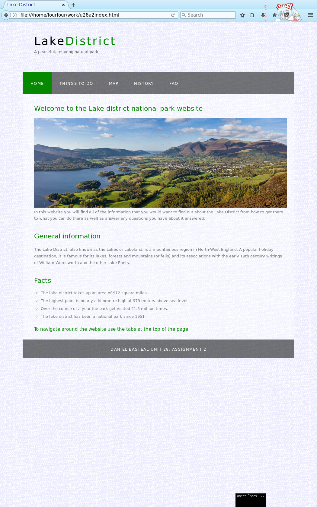
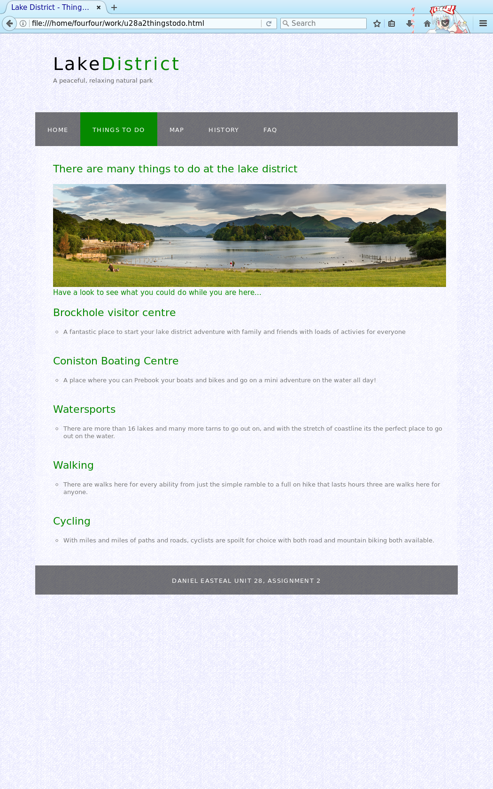
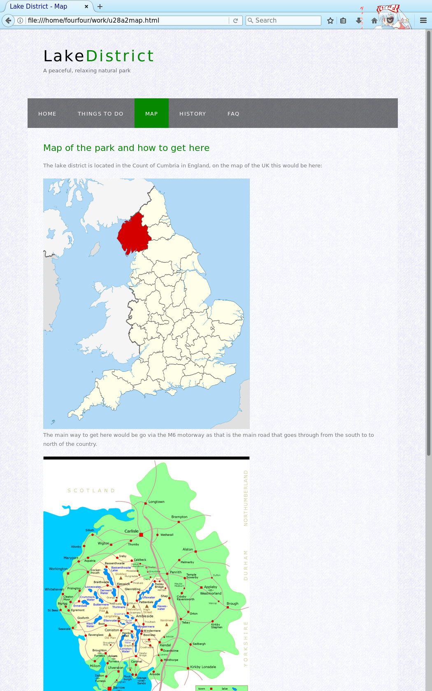
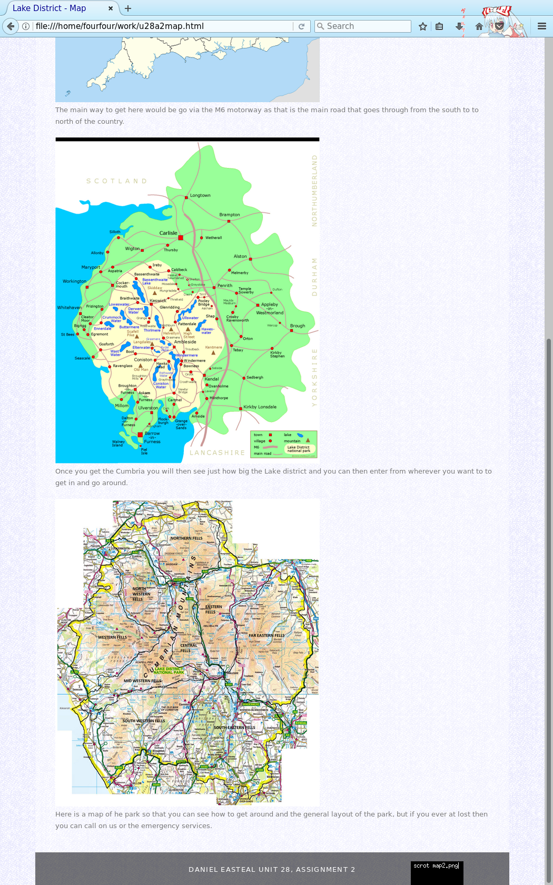
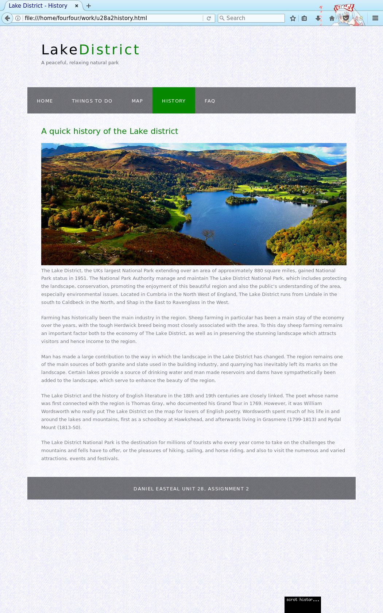
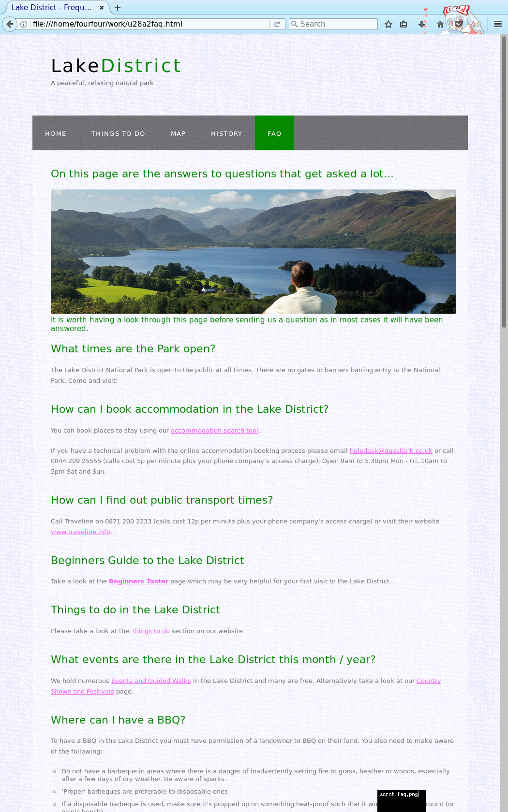
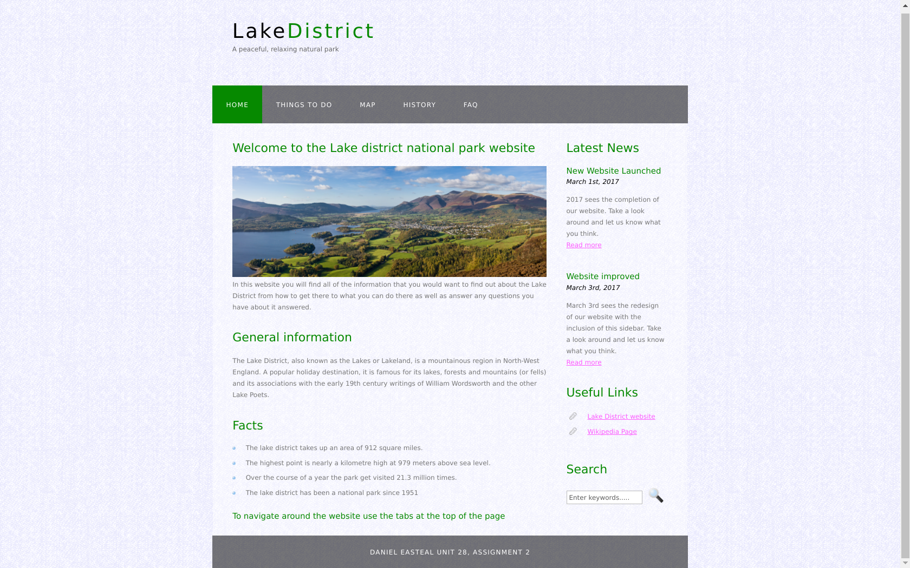
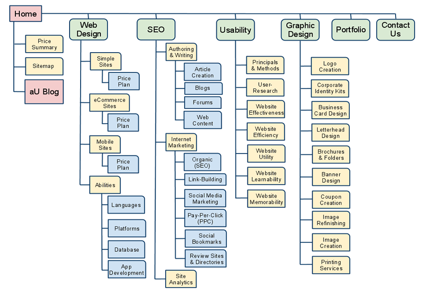

# **Unit 28 - Website development**

> Assignment 2 - Practical 

_Daniel Easteal_

<div style="page-break-after: always;"></div>

## Contents page 

Introduction - 

P4 Using appropriate design tools, design an interactive website to meet a client need  

P5 Create an interactive website to meet a client need.  

M2 Explain the tools and techniques used in the creation of an interactive website  

M3 Improve the effectiveness of a website on the basis of a client review.  

D2 Discuss the techniques that can be used on web pages to aid user access to information  

D3 Demonstrate that a created website meets the defined requirements and achieves the defined purpose.  

Conclusion - 

Bibliography - 

<div style="page-break-after: always;"></div>

## Introduction

In this assignment I will be going through the creation of a website along with how certain parts of it will work together with the user and why these decision's have been made. I will go through the initial design with sketches, the resulting website, the tools used, improvements that can be made and show that the website meets the users requirements. 

## P4 Using appropriate design tools, design an interactive website to meet a client need  

For this section I will be designing the website that I will be showing in this assignment. This section will be showing the design on the included pieces of paper that will be slid in on this section. 

## P5 Create an interactive website to meet a client need.  

In this section I will go through and show the website that I have created for this assignment and show you the code as well as how it actually works. For this there will be the code and the looks for each of the five pages that I have created. 

### Index

The first page that you would come to on this website is the index page and this is the code behind it:

```html

<!DOCTYPE HTML>
<html>

<head>
  <title>Lake District</title>
  <meta name="description" content="website description" />
  <meta name="keywords" content="website keywords, website keywords" />
  <meta http-equiv="content-type" content="text/html; charset=windows-1252" />
  <link rel="stylesheet" type="text/css" href="style/style.css" title="style" />
</head>

<body>
  <div id="main">
    <div id="header">
      <div id="logo">
        <div id="logo_text">
          <!-- Header -->
          <h1><a href="u28a2index.html">Lake<span class="logo_colour">District</span></a></h1>
          <h2>A peaceful, relaxing natural park</h2>
        </div>
      </div>
      <div id="menubar">
        <ul id="menu">
          <!-- Navigation -->
          <li class="selected"><a href="u28a2index.html">Home</a></li>
          <li><a href="u28a2thingstodo.html">Things To Do</a></li>
          <li><a href="u28a2map.html">Map</a></li>
          <li><a href="u28a2history.html">History</a></li>
          <li><a href="u28a2faq.html">FAQ</a></li>
        </ul>
      </div>
    </div>
    <div id="site_content">
        <!-- Main sectionn -->
        <h1>Welcome to the Lake district national park website</h1>
		
        <p>In this website you will find all of the information that you would want to find out about
		the Lake District from how to get there to what you can do there as well as answer any
		questions you have about it answered.</p>
        <h2>General information</h2>
		<p> The Lake District, also known as the Lakes or Lakeland, is a mountainous region in North
		-West England. A popular holiday destination, it is famous for its lakes, forests and
		mountains (or fells) and its associations with the early 19th century writings of William
		Wordsworth and the other Lake Poets. </p>
		<h3> Facts </h3>
        <ul>
          <li> The lake district takes up an area of 912 square miles. </li>
          <li> The highest point is nearly a kilometre high at 979 meters above sea level. </li>
          <li> Over the course of a year the park get visited 21.3 million times. </li>
          <li> The lake district has been a national park since 1951 </li>
        </ul>
		<h4> To navigate around the website use the tabs at the top of the page </h4>
      </div>
    </div>
    <div id="footer">
      Daniel Easteal Unit 28, Assignment 2
    </div>
  </div>
</body>
</html>

```

And here is what it looks like when you visit the website. 



### Things to do

```html

<!DOCTYPE HTML>
<html>

<head>
  <title>Lake District - Things to do</title>
  <meta name="description" content="website description" />
  <meta name="keywords" content="website keywords, website keywords" />
  <meta http-equiv="content-type" content="text/html; charset=windows-1252" />
  <link rel="stylesheet" type="text/css" href="style/style.css" title="style" />
</head>

<body>
  <div id="main">
    <div id="header">
      <div id="logo">
        <div id="logo_text">
          <!-- Header -->
          <h1><a href="u28a2index.html">Lake<span class="logo_colour">District</span></a></h1>
          <h2>A peaceful, relaxing natural park</h2>
        </div>
      </div>
      <div id="menubar">
        <ul id="menu">
          <!-- Navigation -->
          <li><a href="u28a2index.html">Home</a></li>
          <li class="selected"><a href="u28a2thingstodo.html">Things To Do</a></li>
          <li><a href="u28a2map.html">Map</a></li>
          <li><a href="u28a2history.html">History</a></li>
          <li><a href="u28a2faq.html">FAQ</a></li>
        </ul>
      </div>
    </div>
    <div id="site_content">
        <!-- Main sectionn -->
        <h1> There are many things to do at the lake district </h1>
		
		<h4> Have a look to see what you could do while you are here... </h4>
		<h3> Brockhole visitor centre </h3>
		<ul>
			<li> A fantastic place to start your lake district adventure with family and friends with
			loads of activies for everyone </li>
		</ul>
		<h3> Coniston Boating Centre </h3>
		<ul>
			<li> A place where you can Prebook your boats and bikes and go on a mini adventure on the
			water all day!</li>
		</ul>
		<h3> Watersports  </h3>
		<ul>
			<li> There are more than 16 lakes and many more tarns to go out on, and with the stretch
			of coastline its the perfect place to go out on the water. </li>
		</ul>
		<h3> Walking  </h3>
		<ul>
			<li> There are walks here for every ability from just the simple ramble to a full on hike
			that lasts hours three are walks here for anyone.  </li>
		</ul>
		<h3> Cycling  </h3>
		<ul>
			<li> With miles and miles of paths and roads, cyclists are spoilt for choice with both
			road and mountain biking both available. </li>
		</ul>
      </div>
    </div>
    <div id="footer">
      Daniel Easteal Unit 28, Assignment 2
    </div>
  </div>
</body>
</html>

```



### Map

```html

<!DOCTYPE HTML>
<html>

<head>
  <title>Lake District - Map</title>
  <meta name="description" content="website description" />
  <meta name="keywords" content="website keywords, website keywords" />
  <meta http-equiv="content-type" content="text/html; charset=windows-1252" />
  <link rel="stylesheet" type="text/css" href="style/style.css" title="style" />
</head>

<body>
  <div id="main">
    <div id="header">
      <div id="logo">
        <div id="logo_text">
          <!-- Header -->
          <h1><a href="u28a2index.html">Lake<span class="logo_colour">District</span></a></h1>
          <h2>A peaceful, relaxing natural park</h2>
        </div>
      </div>
      <div id="menubar">
        <ul id="menu">
          <!-- Navigation -->
          <li><a href="u28a2index.html">Home</a></li>
          <li><a href="u28a2thingstodo.html">Things To Do</a></li>
          <li class="selected"><a href="u28a2map.html">Map</a></li>
          <li><a href="u28a2history.html">History</a></li>
          <li><a href="u28a2faq.html">FAQ</a></li>
        </ul>
      </div>
    </div>
    <div id="site_content">
        <!-- Main sectionn -->
        <h1> Map of the park and how to get here </h1>
        <p> The lake district is located in the Count of Cumbria in England, on the map of the UK
		this would be here: </p>
		
		<p> The main way to get here would be go via the M6 motorway as that is the main road that
		goes through from the south to to north of the country. </p>
		
		<p> Once you get the Cumbria you will then see just how big the Lake district and you can
		then enter from wherever you want to to get in and go around. </p>
		
		<p> Here is a map of he park so that you can see how to get around and the general layout of
		the park, but if you ever at lost then you can call on us or the emergency services. </p>
      </div>
    </div>
    <div id="footer">
      Daniel Easteal Unit 28, Assignment 2
    </div>
  </div>
</body>
</html>

```






### History

```html

<!DOCTYPE HTML>
<html>

<head>
  <title>Lake District - History</title>
  <meta name="description" content="website description" />
  <meta name="keywords" content="website keywords, website keywords" />
  <meta http-equiv="content-type" content="text/html; charset=windows-1252" />
  <link rel="stylesheet" type="text/css" href="style/style.css" title="style" />
</head>

<body>
  <div id="main">
    <div id="header">
      <div id="logo">
        <div id="logo_text">
          <!-- Header -->
          <h1><a href="u28a2index.html">Lake<span class="logo_colour">District</span></a></h1>
          <h2>A peaceful, relaxing natural park</h2>
        </div>
      </div>
      <div id="menubar">
        <ul id="menu">
          <!-- Navigation -->
          <li><a href="u28a2index.html">Home</a></li>
          <li><a href="u28a2thingstodo.html">Things To Do</a></li>
          <li><a href="u28a2map.html">Map</a></li>
          <li class="selected"><a href="u28a2history.html">History</a></li>
          <li><a href="u28a2faq.html">FAQ</a></li>
        </ul>
      </div>
    </div>
    <div id="site_content">
       <!-- insert the page content here -->
        <h1>A quick history of the Lake district</h1>
		
		<p>The Lake District, the UKs largest National Park extending over an area of approximately
		880 square miles, gained National Park status in 1951. The National Park Authority manage and
		maintain The Lake District National Park, which includes protecting the landscape,
		conservation, promoting the enjoyment of this beautiful region and also the public's
		understanding of the area, especially environmental issues. Located in Cumbria in the North
		West of England, The Lake District runs from Lindale in the south to Caldbeck in the North,
		and Shap in the East to Ravenglass in the West.</p>

		<p>Farming has historically been the main industry in the region. Sheep farming in particular
		has been a main stay of the economy over the years, with the tough Herdwick breed being most
		closely associated with the area. To this day sheep farming remains an important factor both
		to the economy of The Lake District, as well as in preserving the stunning landscape which
		attracts visitors and hence income to the region.</p>

		<p>Man has made a large contribution to the way in which the landscape in the Lake District
		has changed. The region remains one of the main sources of both granite and slate used in the
		building industry, and quarrying has inevitably left its marks on the landscape. Certain
		lakes provide a source of drinking water and man made reservoirs and dams have
		sympathetically been added to the landscape, which serve to enhance the beauty of the region
		.</p>

		<p>The Lake District and the history of English literature in the 18th and 19th centuries are
		closely linked. The poet whose name was first connected with the region is Thomas Gray, who
		documented his Grand Tour in 1769. However, it was William Wordsworth who really put The Lake
		District on the map for lovers of English poetry. Wordsworth spent much of his life in and
		around the lakes and mountains, first as a schoolboy at Hawkshead, and afterwards living in
		Grasmere (1799-1813) and Rydal Mount (1813-50).</p>

		<p>The Lake District National Park is the destination for millions of tourists who every year
		come to take on the challenges the mountains and fells have to offer, or the pleasures of
		hiking, sailing, and horse riding, and also to visit the numerous and varied attractions.
		events and festivals.</p>

	      </div>
        </form>
      </div>
    </div>
    <div id="footer">
      Daniel Easteal Unit 28, Assignment 2
    </div>
  </div>
</body>
</html>

```



### FAQ

```html

<!DOCTYPE HTML>
<html>

<head>
  <title>Lake District - Frequently Asked Questions</title>
  <meta name="description" content="website description" />
  <meta name="keywords" content="website keywords, website keywords" />
  <meta http-equiv="content-type" content="text/html; charset=windows-1252" />
  <link rel="stylesheet" type="text/css" href="style/style.css" title="style" />
</head>

<body>
  <div id="main">
    <div id="header">
      <div id="logo">
        <div id="logo_text">
          <!-- Header -->
          <h1><a href="u28a2index.html">Lake<span class="logo_colour">District</span></a></h1>
          <h2>A peaceful, relaxing natural park</h2>
        </div>
      </div>
      <div id="menubar">
        <ul id="menu">
          <!-- Navigation -->
          <li><a href="u28a2index.html">Home</a></li>
          <li><a href="u28a2thingstodo.html">Things To Do</a></li>
          <li><a href="u28a2map.html">Map</a></li>
          <li><a href="u28a2history.html">History</a></li>
          <li class="selected"><a href="u28a2faq.html">FAQ</a></li>
        </ul>
      </div>
    </div>
    <div id="site_content">
        <!-- Main sectionn -->
        <h1> On this page are the answers to questions that get asked a lot...</h1>
		
		<h4> It is worth having a look through this page before sending us a question as in most
		cases it will have been answered. </h4>
<h2>What times are the Park open?</h2>
<p>The Lake District National Park is open&nbsp;to the public at all times. There are no gates or 
barriers barring entry to the National Park. Come and visit!</p>
<h2>How can I book accommodation in the Lake District?</h2>
<p>You can book places to stay using our <a href="http://www.lakedistrict.gov.uk/visiting/
wheretostay">accommodation search tool</a>
.</p>
<p>If you have a technical problem with the online accommodation booking process please email <a 
href="mailto:helpdesk@guestlink.co.uk">helpdesk@guestlink.co.uk</a>
or call 0844 209 25555 (calls cost 5p per minute plus your phone company's access charge). Open 
9am&nbsp;to 5.30pm Mon - Fri, 10am&nbsp;to 5pm Sat and Sun.</p>
<h2>How can I find out public transport times?</h2>
<p>Call&nbsp;Traveline on 0871 200 2233 (calls cost 12p per minute plus your phone company's access 
		charge) or visit their website <a href="http://www.traveline.info/"> www.traveline.info</a>
.</p>
<h2>Beginners Guide to the Lake District</h2>
<p>Take a look at the <strong><u><a href="http://www.lakedistrict.gov.uk/visiting/planyourvisit/
beginners"><u><strong>Beginners Taster</strong>
</u></a>
</u></strong>
page which may be very helpful for your first visit to the Lake District.</p>
<h2>Things to do in the Lake District</h2>
<p>Please take a look at the <a href="http://www.lakedistrict.gov.uk/visiting/thingstodo">Things to 
do</a>
section on our website.</p>
<h2>What events are there in the Lake District&nbsp;this month / year?</h2>
<p>We hold numerous&nbsp;<a href="http://www.lakedistrict.gov.uk/visiting/events">Events and Guided 
Walks</a>
in the Lake District and many are free. Alternatively take a look at our <a href="http://www.
lakedistrict.gov.uk/visiting/thingstodo/countryshowsandfestivals">Country Shows and Festivals</a>
page.</p>
<h2>Where can I have a BBQ?</h2>
<p>To have a BBQ in the Lake District you must have permission of a landowner to BBQ on their land. 
You also need to make aware of the following:</p>
<ul><li>Do not have a barbeque in areas where there is a danger of inadvertently setting fire to 
grass, heather or woods, especially after a few days of dry weather. Be aware of sparks.</li>
<li>&lsquo;Proper&rsquo; barbeques are preferable to disposable ones</li>
<li>If a disposable barbeque is used, make sure it&rsquo;s propped up on something heat-proof such 
that it won&rsquo;t scorch the ground (or picnic bench)</li>
<li>Make sure the charcoal is fully extinguished and cold after use</li>
<li>Take all charcoal, litter etc away with you and don&rsquo;t discard it on site.</li>
<li>Use locally produced charcoal if possible</li>
</ul><h2>Can I go wild camping in the Lake District</h2>
<p>Legally wherever you camp you must have the permission of a landowner to camp on their land. For 
more information please visit the <a href="http://www.lakedistrict.gov.uk/visiting/wheretostay/wildcamping">
wild camping</a>
webpage on our website.</p>
<h2>How do I pay for my parking in pay after stay car parks?</h2>
<p>Some of our car parks are camera operated, and are managed by a company called Park With Ease. 
These car parks are<strong> pay when you leave. </strong>
</p><h2>Where can I fly my drone?</h2>
<p>Please take a look at the <a href="http://www.lakedistrict.gov.uk/visiting/thingstodo/
drones">drones</a>
page on our website.</p>
<h2>Where / how can I register my boat?&nbsp;&nbsp;</h2>
<p>Only a powered boat on Windermere needs to be registered and you need a permit for any boat 
on&nbsp;Bassenthwaite Lake (powered or not).</p>
<p>To register on Windermere please visit our <a href="http://www.lakedistrict.gov.uk/visiting/
thingstodo/water/windermerereg">Windermere Registration section</a>
to find our prices and&nbsp;other essential information.</p>
<p>To get a permit for use&nbsp;on Bassenthwaite Lake, please phone the Contact Centre&nbsp;on 01539 
724555.</p>
<h2>Which lakes can I use my boat on?</h2>
<p>Please read the <a href="http://www.lakedistrict.gov.uk/__data/assets/pdf_file/0014/314600/Access-
to-Lakes.pdf">Access to Lakes Guide</a>
.</p>
<h2>How can I stay safe on the water</h2>
<p>Please take a look at our safety videos on our <a href="http://www.lakedistrict.gov.uk/visiting/
thingstodo/water/water-safety">water safety</a>
page, these cover carbon monoxide safety, kill cords, life jacket checks and swimming visibility 
devices.</p>
<h2>I have a media enquiry</h2>
<p>Please contact the PR and Social Content Editor, Sarah Calderbank at&nbsp;<a href="mailto:sarah.
calderbank@lakedistrict.gov.uk">sarah.calderbank@lakedistrict.gov.uk</a>
. For more information please visit the <a href="http://www.lakedistrict.gov.uk/aboutus/news/
media_enquiries">Media Enquiries</a>
page.</p>
<h2>How do I get support with making a planning application?</h2>
<p>At the Head Office we have a free <a href="http://www.lakedistrict.gov.uk/planning/
planningcontactus">planning surgery</a>
Monday - Friday, 9:30am - 12:30pm. Bookings are not available. Please ring 01539 724555 to speak to a 
contact centre advisor who will need to know the following information:</p>
<ul><li>What it's regarding&nbsp;&nbsp;</li>
<li>Full address including postcode</li>
</ul><p>Alternatively, you can drop in to see the Duty Planner, although it's first come first served 
so there may be a waiting time.&nbsp;&nbsp;</p>
<p>Lake District National Park Authority<br /> Murley Moss<br /> Oxenholme Road<br /> Kendal LA9 7RL</
p>
<h2>Blue green algae</h2>
<p>If you see blue-green algae please call the Environment Agency on <strong>0800 80 70 60</strong>
to report your sighting. Do not enter, drink or swallow the water. Also keep children and pets away 
from the water.</p>
<p>For more information on what it looks like and how it can affect people and animals, please visit 
the <a href="http://www.lakedistrict.gov.uk/caringfor/policies/algae">blue-green algae frequently
asked questions</a>
page.</p>
<h2>Are there any job vacancies with the Lake District National Park?</h2>
<p>We want to make sure this is a positive, vibrant organisation committed to delivering our services 
as efficiently and effectively as possible.</p>
<p>If you are innovative and enthusiastic, with a flexible 'can do' attitude, then we want you to 
come and join our team.</p>
<p>Take a look at the <a href="http://www.lakedistrict.gov.uk/aboutus/vacancies">Jobs</a>
page, it shows all current vacancies and is updated regularly</p>
<h2>How can I donate to support the work of the National Park?</h2>
<p>You can choose to support us by selecting a place, project or person you wish to sponsor or 
by&nbsp;<a href="https://secure.nationalparks.gov.uk/ld/conservation-donation">making a one-off
donation</a>
.</p>
<p>If you are donating in memory of a loved one or in celebration of a special occasion, you can add 
a simple engraved plaque to a finger post, gate or bridge and choose whether to add a message to our
memorial and celebration web page.</p>
<p>You can also make a&nbsp;<a href="https://secure.nationalparks.gov.uk/ld/event-donations">donation 
to our volunteer-led events programme</a>
, if you wish to donate following a guided walk or event. Thank you, your donation will mean that 
more people can enjoy exploring the National Park now and in years to come. If you have any question
s, please email us at&nbsp;&nbsp;<a href="mailto:aspecialplace@lakedistrict.gov.
uk">aspecialplace@lakedistrict.gov.uk</a>
or call us on&nbsp;01539 724 555 (Monday to Thursday 9am to 5pm, Friday 9am to 4.45pm) and we'll be 
happy to help.</p>
<p>For more information please go to our <a href="http://www.lakedistrict.gov.uk/caringfor/
donate">donations</a>
page. If you have any questions please visit the <a href="http://www.lakedistrict.gov.uk/caringfor/
donate/faqs">frequently asked questions about donations and sponsorship</a>
page.</p>
<h2><strong>Can I leave a memorial in the National Park?</strong>
</h2><p>We regularly receive requests for memorials to be placed in the Lake District National Park. 
We do appreciate the importance of memorials for the families of deceased loved ones and understand how
a memorial in a cherished place or landscape can provide a comfort. However if we were to give 
permission to all the requests we receive, the numbers involved would become extremely intrusive in this
natural and beautiful landscape. For this reason we refuse all requests for memorials on land 
owned by the National Park. For memorials on the other 96 per cent of land in the Lake District, we
ask people to contact the landowner directly.</p>
<p>It is worth noting that memorials, such as benches and structures, may also require planning 
permission. To informally discuss&nbsp;whether you need to apply for planning application you can talk
to a duty planner or attend one of our regular planning surgeries - find out <a href="http://www.
lakedistrict.gov.uk/planning/planningcontactus"><strong>times and dates</strong>
</a>.</p>
<p>You can <a href="http://www.lakedistrict.gov.uk/caringfor/donate">donate</a>
towards a selected location or project in memory of a loved one, whilst at the same time contributing 
towards the future of the National Park.</p>

  

      </div>
    </div>
    <div id="footer">
      Daniel Easteal Unit 28, Assignment 2
    </div>
  </div>
</body>
</html>

```



## M2 Explain the tools and techniques used in the creation of an interactive website  

In this section i will go on to explain how certain parts of a website can be used to make it interactive and how these will all work behind the scenes to make it interactive. The main way that is used to make a website interactive would be to add in the ability for the user to select things on the site and this would then change what is on the page but by not loading another page. One way that this can be done is through the use of radio buttons on the website, these are the circle buttons that you see on websites that allow you to only select one of them rather than multiple, with this the user can then select on of many things to display on the page, but in practice more advanced methods are used due to the fact that radio buttons don't look the best. So, for example if you had a website where you could be a watch then you could use radio buttons to select what colour you want the watch to be and then the appropriate image would load and then when you place your order the correct one will be selected. Behind the scenes, he buttons will work with two different programming languages, html and php in most cases. html is the mark-up language and so this will be how the buttons are placed on the screen and aligned and so on. Then the buttons will interact with the php code behind the scene to actually perform functions like loading the image and so on. The way that this works is that the group of radio buttons are assigned a name and then whenever the value of the radio buttons is changed the value of the name changes as well and this then means that the webpage can then be told to load a different image based on the value of the name and the fact that it has changed. This will work in a similar way to the sending information about the purchase as the webpage will just need to send of the name of the colour of the watch that the user wants and then this will go to the warehouse and the correct colour watch will be sent out to the customer. 

Another way that a website can be interactive is trough the use of textboxes and forms for the users to fill out with this the user can then fill out a large amount of information that they want the website to have and then the website will get all of it and do what it wants. The main ways that this is used is through the use of forums and websites with comments, the way that these then work is that the user will fill the textbox with the information that they want and then send that information of to the website, in most cases this will then past that information along with information about the user who posted it and some other information. The way that this works behind the scenes is similar to the previous example in that the textbox uses both html and php (in most cases). The textbox is placed on the page with formatting with the html and then the information that it contains is process with the php. From here the text is probably scanned for words / phrases that the website would not like to be posted on the website and then it is then processed into html so that it is formatted on the website properly and is not just unformatted text. This could mean placing headers and titles to be underlined or highlighting certain words and so on.   

## M3 Improve the effectiveness of a website on the basis of a client review.  

In this section I will be improving my website based on feedback that I have received from my peers in my class, I will then add these changes into my website to improve it. 

The main improvement that was suggested for the website was the addition of a search function and the inclusion of more information on the screen. The solution for this was to add in a sidebar to the website so that I could display information as well as add in the search function. The code required for this is very small and only needs to look like this:

```html
      <div class="sidebar">
        <!-- sidebar -->
        <h3>latest news</h3>
        <h4>new website launched</h4>
        <h5>march 1st, 2017</h5>
        <p>2017 sees the completion of our website. take a look around and let us know what you think.
		<br /><a href="#">read more</a></p>
        <p></p>
        <h4>website improved</h4>
        <h5>march 3rd, 2017</h5>
        <p>march 3rd sees the redesign of our website with the inclusion of this sidebar. take a look
		around and let us know what you think.<br /><a href="#">read more</a></p>
        <h3>useful links</h3>
        <ul>
          <li><a href="http://www.lakedistrict.gov.uk/">lake district website</a></li>
          <li><a href="https://en.wikipedia.org/wiki/lake_district">wikipedia page</a></li>
        </ul>
        <h3>search</h3>
        <form method="post" action="#" id="search_form">
          <p>
            <input class="search" type="text" name="search_field" value="enter keywords....." />
            <input name="search" type="image" style="border: 0; margin: 0 0 -9px 5px;" src="style
			/search.png" alt="search" title="search" />
          </p>
        </form>
      </div>
      <div id="content">
```

This will now be added to every page on the site and this is what it will look like on the actual pages:



All that this adds is the division of a sidebar and the links to certain areas with the addition of a search bar. 

With this added in to the code the html for the index page will now look like this:

```html
<!DOCTYPE HTML>
<html>

<head>
  <title>Lake District</title>
  <meta name="description" content="website description" />
  <meta name="keywords" content="website keywords, website keywords" />
  <meta http-equiv="content-type" content="text/html; charset=windows-1252" />
  <link rel="stylesheet" type="text/css" href="style/style.css" title="style" />
</head>

<body>
  <div id="main">
    <div id="header">
      <div id="logo">
        <div id="logo_text">
          <!-- Header -->
          <h1><a href="u28a2index.html">Lake<span class="logo_colour">District</span></a></h1>
          <h2>A peaceful, relaxing natural park</h2>
        </div>
      </div>
      <div id="menubar">
      <div class="sidebar">
        <!-- sidebar -->
        <h3>latest news</h3>
        <h4>new website launched</h4>
        <h5>march 1st, 2017</h5>
        <p>2017 sees the completion of our website. take a look around and let us know what you think.
		<br /><a href="#">read more</a></p>
        <p></p>
        <h4>website improved</h4>
        <h5>march 3rd, 2017</h5>
        <p>march 3rd sees the redesign of our website with the inclusion of this sidebar. take a look
		around and let us know what you think.<br /><a href="#">read more</a></p>
        <h3>useful links</h3>
        <ul>
          <li><a href="http://www.lakedistrict.gov.uk/">lake district website</a></li>
          <li><a href="https://en.wikipedia.org/wiki/lake_district">wikipedia page</a></li>
        </ul>
        <h3>search</h3>
        <form method="post" action="#" id="search_form">
          <p>
            <input class="search" type="text" name="search_field" value="enter keywords....." />
            <input name="search" type="image" style="border: 0; margin: 0 0 -9px 5px;" src="
			style/search.png
			" alt="search" title="search" />
          </p>
        </form>
      </div>
      <div id="content">
        <ul id="menu">
          <!-- Navigation -->
          <li class="selected"><a href="u28a2index.html">Home</a></li>
          <li><a href="u28a2thingstodo.html">Things To Do</a></li>
          <li><a href="u28a2map.html">Map</a></li>
          <li><a href="u28a2history.html">History</a></li>
          <li><a href="u28a2faq.html">FAQ</a></li>
        </ul>
      </div>
    </div>
    <div id="site_content">
        <!-- Main sectionn -->
        <h1>Welcome to the Lake district national park website</h1>
		
        <p>In this website you will find all of the information that you would want to find out about
		the Lake District from how to get there to what you can do there as well as answer any
		questions you have about it answered.</p>
        <h2>General information</h2>
		<p> The Lake District, also known as the Lakes or Lakeland, is a mountainous region in North
		-West England. A popular holiday destination, it is famous for its lakes, forests and
		mountains (or fells) and its associations with the early 19th century writings of William
		Wordsworth and the other Lake Poets. </p>
		<h3> Facts </h3>
        <ul>
          <li> The lake district takes up an area of 912 square miles. </li>
          <li> The highest point is nearly a kilometre high at 979 meters above sea level. </li>
          <li> Over the course of a year the park get visited 21.3 million times. </li>
          <li> The lake district has been a national park since 1951 </li>
        </ul>
		<h4> To navigate around the website use the tabs at the top of the page </h4>
      </div>
    </div>
    <div id="footer">
      Daniel Easteal Unit 28, Assignment 2
    </div>
  </div>
</body>
</html>
```

## D2 Discuss the techniques that can be used on web pages to aid user access to information  

In this section I will be going through how a website can be designed to aid the users access to information so that the user of the will be able to access the content that they want to both quickly and easily. The main ways that this can be done is through the use of navigation aids throughout the webpage that will help the user get to what they want with the minimal number of clicks needed. A few examples of these navigation aids would be sitemaps, search bars, anchors and sub-menus. For this section I will be explaining all of these features and how they will actually aid the user along with how they work. 

### Sitemaps

One of the main aids that are used for people trying to find a specific thing over multiple websites would be to use a site map. This is a list of where you can find certain things on all of the websites that are a part of the main website. This will only really work where there is main website and there are multiple websites that are a part of it bus still separate. For example, the Cashew website is designed so that it has one main page and then all of the sub brands have their own website, as an example the Csio website has its main site casio.com and then has a separate website for the edifice collection of watches at http://edifice-watches.co.uk. A sitemap will work well with this company as they will have many different subsections and products that are hidden away under many different subsections, in addition to this with more than one website you will be able to map it out easily. For example, here is what a site map could look like for a random website:



As you can see, In this image there is the layout of the website along with where all the links lead and how they lead to one and other. If you were to actually look at a sitemap then it would in most cases not be bayed out in this format but would instead be layout out as an indented list rather than a diagram. This will help people as it will mean that the users will be able to find anything that they want to on the site without the need for them to go through all of the links to get there. This will mean that they will be able to find what they are looking for and there for this will by definition aid the their access to the information they they are trying to get to. 

### Searchbars

A search bar is one of the most common and liked methods to aid users access to information and the way it works is simple to describe, but the way that it is implemented can be very complicated. The way that a search bar works is that the user will type in what they want to find on the website and then the web server will process this information and send back to the user the results of the search so that they user can then find and gain access to what they want. In most cases the search bar is not a consistent search bar bus is one where the user will have to press enter to get the result that they want and the they will be redirected to the search page. The difference between these two is that the consistent search bar will get the results of the users search constantly and as they are typing, This will therefore mean that system will constantly be searching through the database to get the results as soon as the user types. This will have the result of making the website in general slower and therefore less usable in general if it is badly designed. In addition to this, due to the fact that it will not take you to a new page when it will display the results the user could get to them faster as they will stay on the same page, this may also make it easier to search for many things as you will always stay on the same page. On the other hand if you have the traditional search bar then each time the users searches for something then will be taken to a separate search page where the results are displayed. This is good as it only means that the database is queried when it is needed to and the user will not type in anything more to search for, this will have the effect of then reducing the traffic that the website has to handle when using the database and so it could feel faster to search for something if you have a fast internet connection. In addition to this, the fact that you have to change page when you are searching for something could make it more difficult if you want to search for multiple things. As you can see, this will help aid the users access to information that the website would contain as this will make them able to find the information that they want to access, even if they do not exactly know what it is that they want. 

### sub-menus

For the final section of this assignment I will be going through how sub-menus can be used to aid user access to information on a website. In a general sense, a sub-menu is a way to separate what is currently displayed under the current section and the splitting that down into a list of smaller section that progressively get more and more specific so the user can work there way to where they want to go. For example, if you had an on-line shop then you could have sub-menus based on what the type of food is, e.g. dairy, dry, canned, bagged and so on....Once you then go into these sub-sections you will have different sub sections that will lead to more specific areas within these, so for example, if you  has the section of canned then it could sort between savoury, sweet or maybe snacks and proper food. As you can see, this will make it so that even if you do not know the specific food that you are after, you will be able to find one that you want or even the specific one if you did now know its name based on general facts about the item. 

## D3 Demonstrate that a created website meets the defined requirements and achieves the defined purpose.  

In this section I will be going through how the website that I have created is suitable for the purpose that it was created and that is to show some information about a place in the UK and then tell people about it and what you can do there and so on. 

To start off with I will explain the end goal of the website and why it was that I needed to create it and what it should show. 

The main goal of this website was to promote and advertise a place in the UK and then provide information about it to someone who would be wanting more information about that place or would want to go to there. In order to do this we needed to have 5 different pages in the website that would each have information on a different place in the UK. For this website I decided to do the website about the Lake District as it is a fairly popular place in the UK that I happen to already to have information about. The five pages that I did for the website were home, things To Do, Map, History and Frequently asked questions. I chose these questions as these ones will cover all the information that people will want to know as well as being good all round information. The home page was needed as it would introduce the website, tell people how to use it as well as providing some basic facts about the Lake District that people might want to know. The next page was the Things to do page, this page contains information about the activities that are available at the lake district from cycling to water sports and activity centres. This will be useful for people to get information on what they can actually do when they go to the lake District and they can then plan their day and get a feel for the place. The next page was the map page, this was a fairly simple page as it just contained some information about where the Lake District is located in the UK as well as what county it is in and so on. In addition to this there are also some instructions on how to get to the Lake District with some road names that you can follow. The next page is the history page and on this page there is a small segment on the history of the Lake District as well as the how it actually came to be so popular. Finally there is the frequently asked questions page. On this page there is a list of questions that people have asked about the Lake District and the answers to those questions, this will mean that any questions that people may have could be answered by the website rather than by asking a person.  


In addition to this there is also the fact that the website is just in general designed to be the right colour for the task it is doing. I say this as the website has a green and white colour scheme and this will reflect the lake district perfectly as the lake district is a relaxing place with natural green colours and so I reflected that in the design. 

Overall I would say that the website is fit for purpose as it meets the requirements for the website at presenting information of a place in the UK and it also achieves that very well. 
<div style="page-break-after: always;"></div>

## Conclusion

In conclusion you can see that I have managed to create a website for a specified purpose as well as being able to design certain aspects of it and show that I understand website concepts.  

## Bibliography
