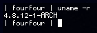
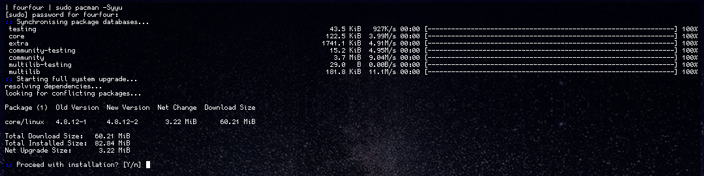
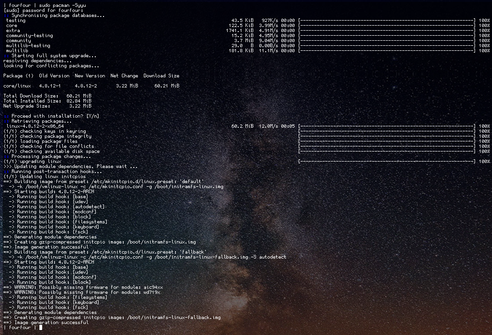
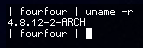

# **Unit 29 - Installing and upgrading software**

> Assignment 2 - Know how to prepare for a software installation or upgrade 

_Daniel Easteal_

Contents page 

* Introduction
 
* P3 - Plan an installation and upgrade
 
* P4 - Record and complete a software installation
 
* P5 - record and complete a software upgrade
 
* P6 - explain the importance of the user acceptance process
 
* M3 - Design and implement a procedure to preserve data integrity during an upgrade
 
* M4 - design a procedure to back out of software upgrades
 
* D1 - Justify a particular installation or upgrade
 
* Conclusion
 
* Bibliography

## Introduction

In this assignment I will be going through the steps and processes that are required to install and upgrade software on a machine. For this I will be planning and recording the installation of software onto the machine as well as explaining how the customer acceptance process is important and how this can be made better. Finally I will be creating a procedure that I will use to backup all of the information and data as well as justifying why I have upgraded the software that I have. One important thing to note here is that I will be installing the software and upgrades into a Linux system and as such I will be using the command line to do so so the process may not look the same, but I will explain it as I go through. 

## P3 - Plan an installation and upgrade
 
In this section I will be going through and explaining the planning procedures that must be required before you install or upgrade any software on a computer system. 

* Planning 
* Testing 
* Delivery 
* Shipping
* Storage
* Software specs 
* Communication
* Logs
* Security
* Confidentially
* Contractual requirements

###  Planning 

When installing or upgrading software you will need to plan out exactly what you are going to do and you are going to do it and this requires planning. Due to the fact that every system that you will be using is different there will be a need to get as much information about a system as you can before you actually go to install the software onto it. In most cases this will work fine, but occasionally the software that you are installing might not actually work and there could be massive errors that you get with the software that you will have to fix. These also need to be planned for. If you are installing the software on a system and you did not plan for the software to go bad when you were installing it then you may not know what to do, or your co-workers may not know what to do and in this case a higher level of action is required. This will therefore lead to a person being called when they did not have to and could lead to losses for the company as their at are not always available when they are required to be. However, if there was planning for the installation then the person installing the software would have known what to do in the case of an error and it could have been sorted out quickly and efficiently. 

###  Testing 

Another thing that you should always do if possible when you are installing software is to test the software first to ensure that it actually works and meets the needs of the customer because otherwise they would have no use for it. The best scenario that you can have with this is that you have an exact replica of the customers computer with the all the software and configuration exactly like they have it. In a perfect world this would happen and this would mean that you would be able to install the software on that system to see if it works. It if does not work then you could solve the problem and find a solution for it so that when you actually go to the customers system you know exactly what you need to do to get the installation to work or you can tell the customer with 100% certainty that the software would not work on their system. However this will never happen in practise so you should always try to get the best representation of the customers computer to test the software on. For example, if you have a machine from the same era as the customers then you could install the same operating system as them to see if it will actually install n that machine and if yo need any other software. Or you could get a machine with the same processor to install it on that.... I could go on and on. But you should try to get the closest you can to the customers system to ensure that the software will work on their system and that it will actually do whet they require from it. 

###  Delivery 

Another procedure that will have to be considered when installing software onto a machine is how you are actually going to get the software onto the machine and deliver the working computer software to the customer as that is what they need. For this to happen there will need to be a way that you can either get to the customers computer physically or logically so that you can install the software and ensure that it works. This would mean that you would either have to ensure that you can get a person on site actually install the software or you would have to have a secure remote access to the computer so you can install it that way. When actually comparing these options the best one to actually do would be to actually have a person inn  front of the customers computer when  the installation is taking place, this is because with this method if anything strange happens then there will be a person in front of the computer that knows what to do, but with the remote method you only get the output that the computer tells you. For example if the compute would not boot up after installing the software then a person remoting into the system would not be able to actually solve it as they could not access he computer. This will mean that the customer will actually have the software delivered to them as otherwise this could not happen.  

###  Shipping

The shipping of the software is again very similar to the previous point about delivery, but in this case it as about how to actually get the hardware of the system to the customer rather than just the software that they need. This will need to happen if the customer has sent in their computer to a physical location and requires it to be upgraded or some software be updated. Worth this you should always ensure that the computer that you are shipping is shipped very well in order for there to be no damage that could occur to the machine. This needs to happen as otherwise the computer may not work after you ship it due to physical damage and in that case you have made the computer worse for them, not better as they paid you to do. You should also ensure that you have a proper shipping date told to the customer early, this will then allow them to set up their system for the software and other important things like that, if you don't tell them this then they could be unhappy with you. 

###  Storage

One of the most important things that always need to kept in account hen installing software on a computer system is weather the system actually as enough storage for both the additional software and the data that this new software will need to use. On most modern systems this will not be as much of an issues as on old systems due to the increase in capacity and reduction in price of storage types. With older system the amount of available space will need to be confirmed by the customers as well as by the technician actually installing the software and this needs to happen before the installation process has even began as other wise this could lead to errors with the software that could break the computer. However, one factor that is not normally kept into account is the space that is available for the program to use and not just how it is stored on the computer. For example if the customer want to install a database software then you will need to ensure that they also have enough server space for the information that the database will contain and not just the installation of the database software. In most cases you would want to install the software on a main hard drive on the server that will be running the software as this will have a large enough storage space for the software and its information. 

###  Software specs 

The main factor when installing software in a computer is weather the computer will actually be able to run and handle the software that has been installed on it. This can have many many different dependencies based on all of the hardware that is actually in the computer, but the main factor in this would probably have to be the CPU or processing power that the computer has inn order to run the software. So lets say that the software is actually designed for this type of CPU so there are no other errors with the program then the software could run very slowly due to the fat that the CPU is not powerful enough. This can lead to the customers get frustrated with the software as it would provide an unsatisfactory customer experience and they may not like using it at all, this will waste both you and the customers time. How ever another factor as previously mentioned would have to be the available storage on the computer and you have already read that section. You can see how this would carry on... 

###  Communication

The installation and process of the software installation is also another things that needs to be considered. This would mean that throughout the installation or upgrade of a system the customer should be informed about how how the installation or upgrade is going and how their system is handling it. This will let them know first hand weather the software is actually working as the original plan or weather there will be a delay with the process that they can then plan and adapt for. If you don't let the customer know this information then they could get angry at you as their system is not working when you said that it would be. This can be done in a variety of ways from actually having a representative from the customers company on the phone at all times in order for them to know how the installation is going at all times and in real time. You could also ensure that you keep very frequent logs of the system process and email them to the customer at regular intervals throughout the process. 

###  Logs

Similar to the last point there should also be frequent logs about both the installation of the software and when the software is actually up and running to ensure that it is actually working properly. The first set of logs will need to be kept and used by both the customer an and you as this will be important to know any problems that occurred throughout the installation and the ow the progress is going for the customer. This may also help you in future situations where you get the same issues as you can look back at the log to see how it was fixed. 

###  Security

Another thing that will need to be ensured is the security of the installation or software update. One of the ways that this could count is by ensuring that the people who are installing the software on the system actually have access to the administrator accounts so that they can access and fox any problems they may be facing.  However, you must ensure that this information is transmitted throughout a secure system so that the information does not get in the hands of anyone else who could abuse the system. Furthermore when installing the software the installer must ensure that there will be no security flaws of problems with the system that would allow for unauthorised access. Furthermore all information that is sensitive should be encrypted so that even if the information is stolen or lost then its content cannot be read and the information is secure. 

###  Confidentially

Penultimately there is the fact that when you server your service to customers you must ensure that all information that you have access to and have been given is very confidential and no one else should even gain access to it. This would include information about logion details for the system  as well as the configuration that it has in terms of connecting to the internet as well as the information about how to log into the system and the contents and files that ere on there. If this information were to get out to the public then someone would be able to hack into the system and steal all of the information and this would be the worst for a company that you would be helping. 

###  Contractual requirements

Finally the last thing that you shooed ensure that you do when you are installing or upgrading software is to ensure that you are keeping up with and following the contractual requirements as you set out to the customer when they accepted your service. This can offer both advantages to what you need to offer as well as constraints about what you can actually do and offer. For example you might not actually allow the users to open up a bug issues for a software hat has been on their system for over a year and as such you would have to ensure that they open up a new case as it would be unrelated. This cold then limit what you can actually do with the customers system and so on. However, on the other hand if you are required to help the users with all the issues related to a problem and fix the issue with the problem in at least 3 days then you would need to ensure that you do this and actually keep up the promise that you gave to the customers as otherwise your company would have to pay them some compensation or renegotiate the terms of the contract. 

## P4 - Record and complete a software installation

In this section I will actually be going through and installing Libre office on to my desktop. The way that I will be doing this is through the use of the command line updating tool for my Linux type: arch Linux. The way that updating work on Linux is that a remote file server contains all the software, and the computer downloads and unzips them to install them. This basically puts all of the software that you have on your computer into one system and program that sets it all up for you. The way that I do this is: ***pacman -S software_name***. Pacman is the name for the PACkage MANager which is the process that unifies the software and actually makes it work on my computer. The -S on the end tells the package manager to sync the software with the software on the file servers, this will then download the software and then install it on my computer. So basically this is how I will be installing the software on my machine as it is very simple to do and explain, with the added bonus that this will also download all the other software that the program needs as well, you will see all this in the images below. Penultimately the software_name is the name of the software that you want to install and in this example this is libreoffice-fresh, the fresh in this part indicates that the software is the new version rather than the one for long term support. Finally, the *sudo* that I add to the beginning will tell the computer that I want to run this command as the admin of this computer not just as a standard user, 

To start off with I will type the command ***sudo pacman -S libreoffice-fresh*** into the terminal to tell the computer that I want to install Libre office, and this is the output that I get from that command:

As you can see we get quite a lot of information, but I will explain it line by line. To start off with, the first line that you see here is just the initial command tart I typed in to the terminal to tell the computer that I wanted to install the software. The line below that asks for the sudo password for fourfour, on my machine my username is fourfour and sudo is the way that you elevate a command to be run as the administrator of the machine rather then just the standard user. Its very similar to the User Access Control window you would get on windows when you install program as that asks you for the admin password. Anyway I type in my password and then it carries on. The next line says "resolving dependencies", when installing software a dependency is another piece of software that the software you are installing needs, think of it like a house and a foundation, if you want to install the "house" then you will need to install the "foundation" first so the house is actually stable and works correctly. The resolving part just finds on the file servers where these additional required packages are and then installs them for you as well. After that it goes on to say that it is looking for conflicting packages, these are other pieces of software that are already on your machine, but would get in the way of your current installation, so they would need  to be replaced. For example, lets say that you were building a house and you already had concrete foundations in place for the house in the ground, but when you talk to the builders you realise that you will need steel foundations instead! There for the concrete foundations get in the way and need to be replaced by the correct foundation that will work. This is very similar as you may have the right software installed on your machine, but it does not have the required functionality so you may have to replace it with the software that your new software needs as otherwise they would inflict. After this it then lists the packages (pieces of software) that are going to be downloaded)

As you can see there area a lot of pieces of software that need to be downloaded (27 infect) and only one of those is the software that you want, that is because these are all the dependencies that the software you want to installed needs to ever run at all. Next to the names of all the software you also see the version number of it (useful for when it is an update) as well as the Net change the software will have on the space on your hard drive and the amount that actually needs to be downloaded for that package. The reason tart the disk space and the download size don't match up is because the package manager download the software in a compressed format so to save on download limits and increase speed for just a little bit of decompression time. At the end of the list of all the packages to get installed it then totals up all of the download size and hard drive space that this whole procedure will take up. As you can see this installation will download 113MiB of information and then extract that to take up 549GiB on my hard drive.  Finally it then asks if I actually want to install this software now that it has totalled it all up for me and I just type y or enter to install the software. A few seconds later after the software has been installed this is now what the terminal looks like. 

As you can see, in this image the previous stuff in the terminal stays there and it just carries on putting stuff to the screen about how it is doing the installation. The first new thin g on this is now the Retrieving packages tittle, this lets me know that it is now downloading all of the 27 packages for the software. This is then followed by a list of all the pieces of software as they are being downloaded. As you can see, after the names and version of the package you also get how much overall the process has downloaded as you can see that this number counts up with every package that has been downloaded. Next to that is a list of the internet speed as it downloads all of the packages, this varies a bit as the software may be downloaded from any of the many file servers so it uses this to help optimise where it should download other packages from. To the right if that again you get a running total of how much time the process is taking and in this case the while download only took 12 seconds overall with the final package to be installed taking up 8 of the 12 total seconds as that was by far the biggest package. Next to that is then a bar that would fill up as the download was happening so you could visually see the progress very quickly but because I took this picture after that fact all the bars are filled. Finally the number on the right is a total percentage of all the download and progress of the installation a bit further down as well.  After this you then get a list of all of the things that the software is doing to actually get installed. The first few items in this list check if the software you have downloaded is actually when you meanest to download and that the file server you downloaded it from was not hacked to give you something else. Then it checks if the software all downloaded in one piece and that there are definitely no conflicts with the software and there is defiantly enough hard drive space to extract the software onto. After this it then sets up and installs all of the individual packages and does what it needs to do to get them up and running on the system. Finally at the end of the list it has installed the software successfully and so put me back to the command line where I can carry on with what I was doing. In total this process took about 15-20 seconds in total and after that the software was installed and worked perfectly.  

So as you can see I have shown the installed programs as well as the files that have been saved and downloaded by the computer. Additionally there was no configuration to get through with the installation because it all was all handled by the package manager program and it set up all of the software for me so that it would install correctly. 
 
## P5 - record and complete a software upgrade

In this section I will be going through and upgrading the operating system on my computer. When I say this I mean that I will be updating Linux as a new version has been released and is available for my computer. This process is very similar to the previous example as I will also be using the command line to do this with.

To start off with, what actually is the Linux that I will be upgrading and how will I actually upgrade it. Put simply, Linux is the basic operating system that controls and organises everything that is on my computer and this is run as a process that is constantly running in the background. When I am updating this I am changing the code that that will be running. And the command that I will use for this is: ***pacman -Syu*** Again, the pacman part is the package manager that sorts this all out. But the -Syu part in this case will check all of the software in my machine and check it it has been flagged for an update, if so then it will sync with the file servers and download the new parts of the software and install it for you. 

Finally in addition to this I will be showing the output of the command ***uname -r***. The command will tell me the current version of Linux that I am running so it will be used to show if the upgrade has succeeded or not.

So to start off with here is the current version of the Linux that my computer is running. As you can see it is 4.6.12-1-ARCH, this tells me that I am running Linux version 4.8 and tart I am using the distribution of arch Linux. This is what I will upgrade. Now telling the computer the update command we see that there is an update to the core Linux software, so there is an update to the operating system: 

The first few lines of output from this command show that my system is currently downloading the new lists of all the software that is available via the package manager as well as what versions they are. After that the package manager looked on the software on the computer and saw that the Linux software from the core file server was flagged for an update. But in order to download the software the package manager will  need to check for any additional software that will need to be downloaded in order for the actual installation of the Linux software to work properly, these are called the dependencies. This is became the core software that you are updating depends on these additional software packages to run and work, but in this case there was no additional software that needed to be downloaded so it can just be downloaded by itself. On the same line as the name of the software being updated we can also see the old and the new version that will be installed, as previous command showed the old version of Linux that I an running on this machine now is 4.8.12-1 and that this update will upgrade this software to the new version of 4.8.12-2 as expected. In addition to this it also shows you the total net change that the software will have and that is calculated to be the difference in disk size between the new and the old version, so it will use up 3.33MiB more space on my computer. Finally on that line it shows that the amount of software that will be downloaded and that is 60MiB so I know that it will not take long. On the three lines below that it then goes on to show the summary of the downloading like just explained, this is put in place for when you are updating multiple pieces of software as it will sum those values up for you so you get a total. Finally it then asks if I want to carry on and actually install and upgrade the software rather than just seeing what is to be upgraded. 

At this stage I just type in y or enter and the software will start to download as shown in the image below. 

So here is what the terminal looks like after you have updated the software and as you can see the initial installation question and summary is still there. Directly after the previous picture we see that the package manager instantly starts downloading the packages (software) that needs to be upgraded. And as you can see this is the 60MiB it says it would be and at the internet speed of 12MiB per second we can also see that this took only 5 seconds to complete. The bars at the side were used to display the progress when the actual downloading of the software was happening. The next five lines then go through and check that the software that was downloaded will actually work. It does this by making sure that the software on the computer exactly matches the software that it should be be checking that all the values are in the appropriate places. It then goes ion to check that he software is all in one piece, then it loads it, checks that it is definitely not already installed and that there is enough disk space for it. From here it now installs the software onto the computer. The rest of the lines basically mean that it is setting it all up and regenerating the start-up files to actually run the new software when the computer starts and ensuring that it is all in place. At the end when the installation and upgrade is successful it then says that the creation of they image was a success and puts me back to the terminal.  

At this point however, the system is not upgraded as I actually need to restart the system to have the new version of Linux running and that is what I do...

After a reboot with no differences from normal I start up the terminal and type the same ***uname -r*** command to see what version of Linux I am now running and here is the result. 

As you can see the computer is now running Linux version 4.8.12-**2** ARCH and so the operating system has been updated. All in all this process took no longer than 30 seconds as the longest thing that took place was the rebooting of the computer, but that was really quick at a few seconds like it normally is. 
 
## P6 - Explain the importance of the user acceptance process

In this section I will be explaining the importance of the user acceptance process when returning a system that you have changed in some way from the installation of software to the upgrading of the operating system. For this there will be three section that I will talk about and these are:

* Configuration to meet customers needs 
* Handover to the customer
* Customer acceptance

I will also talk about how this actually works and how to ensure that each stage has been completed and it is its best setup.  

### Configuration to meet customer needs

When you are ready to hand over the computer / system with the new software you will need to ensure that the software is actually installed and that it works for what the customer needs it for. In order for this to work you need to ensure that the software actually works for what the user has wanted and this could mean going through a bit of basic testing and this could lead to troubleshooting. 

For the installation the installer would have to install the software but this could lead to errors while installing some of which I have listed in a previous section. In order for this to be fixed the installer must troubleshoot the problem so that the install will actually work. If any errors are created then there are many different reasons that this could happen. For a list of these examples you can look up to the first criteria as I listed hardware problems and installing problems there. After the installation has been completed then the installer or the organisation will need to check the software and test it to ensure that it works in a very basic sense. This can mean making sure that it actually runs on the computer and that there are no errors or problems when actually showing information on screen and that all the windows and rendered correctly.  This is just the basic testing stage as this will let you know if the software works like the software wants to, now on to the next stage. 

### Handover to the customer

After the software has been installed and tested you will need to ensure that the software actually works for what the customers needs to use the software for and that it actually works with  the system that they have in palace. For this to happen there should be time arranged where the new system can be tested with both the customer and you present. This is so that the customer get get to use the software on a small part of their actual system that they have so that can test its usability whilst having you there to fix any problems that may develop with the system. For example if the users system needs to communicate with the new software in a certain way that they did not mention before then this can be fixed and added correctly to the configuration so that it will now work. Additionally, if you were told that the software needed certain settings that they did not say correctly then the scan also be fixed and added to the configuration.  As you can see this will allow the customers to test the system whilst being in an environment where the software failing would cause no harm, with the final advantage of having the software being able to be fixed immediately by a professional. 

### Customer acceptance

After the company and the customer are both happy with the software and after testing are sure that it works then the customer handover process can begin. This is the process about how the customer actually sets up and uses the system along with any additional or further help that they will need in the future. After the user and the company have both accepted that the installation of the software is stable and actually works then the customer will start to installing the software on all of their machines that they have. From this point on any addition problems that the software has been stored out under a different contract as at this point the customer has accepted that the software works so this will cost more than the bug fix would have done at the beginning. At this point the company would have to take away additional time to fox this bug and so that is why. In addition to this this customer may choose many different methods to install the software on to all of the machines they they have. If they have installed the software on all of their machines then it would be more of a problem to install and update the software again so that it works. This would then be worse then if the customer only installed this update on a few machines as that would lead to further and more problems. As you can see after the user acceptance processes has been done the difficulty can be greater to fox the problem as it would be more of a hassle. 
 
## M3 - Design and implement a procedure to preserve data integrity during an upgrade & M4 - design a procedure to back out of software upgrades

In this section I will be explaining about how data and information can be preserved throughout the process of an operating system upgrade such as the on described in P3. I will go through the different types of backup as well as the procedure that should be followed to ensure that the information and data keeps its integrity so that it can be recovered if the installation or upgrade of the software did not work. I am also going to combine these two sections into one due to the fact that they are both very similar with one begin describing and one being actually doing it. I will start off by going through backups.

### Backups

A backup is where the user of a system will take some of the information on the main hard drive of the computer or where ever it is stored and will the move only that select information to an external storage place that is not that computer. This will therefore mean that if anything were to happen to the main hard drive then the information and data would still be safe as it would be elsewhere. There generally needs to be a certain level of separation because if a disaster happens then the information could be destroyed on the backup if it is also in the same location. However, the information may only need to be backed up for a very small amount of time due to a planned hard drive reset. In this case it would be OK to have the information stored close by as you would need to access it quite son and the risk of danger is quite low for the information.  

There are many different ways that you can backup files and it depends on what you are backing up and how many files there are and their sizes. For example, if you had a lot of files that you would want to access on a regular basis then you would to have that backup close by at all times and this would be perfect for a USB stick as this would always be available and have very quick and easy access on whatever computer you are on. But if you just want to backup some very old but important files, then carrying them around with you would not be an option due to security so you would want to get an external hard drive that you would keep at home so that you always have access to them yet they are secure. Finally if you have a lot of small files that you want to access on all devices some  of which are quite important then online backups would be the best as this would mean that you have access to them anywhere, but no one else can do. 

In this example the backup is being performed due to the fact that the had drive will be wiped as a new operating system will be installed and if it brakes and the information and data is needed to be erased then the information is still the available. This is just a precaution for the use of Linux as this would not require the removal and resetting of the information on the hard drive, but it is still a good practice to do just in case any thing does happen. For this I will just backup the home folder of my account on the hard drive not the whole system. I chose to do this as I only need the information that I have created to be backed up and as I will be presented with a new operating system I do not need to backup the old operating system files. For this I will just use a very basic Linux command of ***cp /home/fourfour/ /mnt*** What this will do is it will copy all if the information from my home directory (So all my documents and work) and it will copy them to the /mnt directory which in this example is where I have an external hard drive commented. You can see the image of the command below: 

Unfortunately there is no out put poof this command once it has finished so you will just see this. But as you can see this will backup all of the data and information on the system that I care about and copy it to an external hard drive, this will then allow me to copy back all the information later on if the installation goes bad and does not work. 

### Disk cloning 

an alternative to backups is disk cloning, while disk cloning could technically be throughout of as a type of backups it is quite different from the normal backup and a bit more technical.  The basic way that a disk clone works is that you copy every simple 1 and 0 on the hard drive to the same location on another hard drive. Now you may think they this is just the same as a normal backup as that will also copy across all the information that you have off the disk and onto the new one, but a disk close will also keep every single file and partition and special sectors exactly as they normally are. This can be great as it will create an exact clone of your disk tat can be be used in place of the occasional hard drive with no additional configuration or installation of any software or anything. If you think about at the backup only backed up the information that you needed the most like reports or images and so on, but the disk clone also backs up all of the operating system and so on.  

However, it is not necessary to do a disk clone all the time as it takes a whole ans uses up to same storage as the original save so you need one at least the size of the original hard drive to make it work. So these are generally only used for the backup of systems that are set up exactly as they are needed and for administration purposes. I have also as a precaution used a lie Linux command to backup my whole drive before the install to the external hard drive just in case it went so wren that I could not recover, everything would be as it was.  For this is used the ***dd*** command as this is the inbuilt disk cloning command. You give this command the Input File as the drive that you wan to clone and you give it the Output File as the drive you want to clone to and it will clone the driver perfectly , bit by bit and save all your information and data. Below you can see the command I used:

As you can see this command uses the do command and then it uses the input and output drives to copy send and receive the information. One thing to note here is that **if** stand for Input File and for this I used /dev/sda1 as on Linux this is where the first partition of the main hard drive is located in file format that is required for the do to work properly. And as you can also guess **of** stands for Output File and in this case it is /dev/sob as this is the location of the first partition of the second hard drive detected by the computer. This will therefore copy all of thee information from main drive of my computer to the external hard drive that I have plugged in to back up the data and information to.  
 
## D1 - Justify a particular installation or upgrade

## Conclusion - 

## Bibliography

