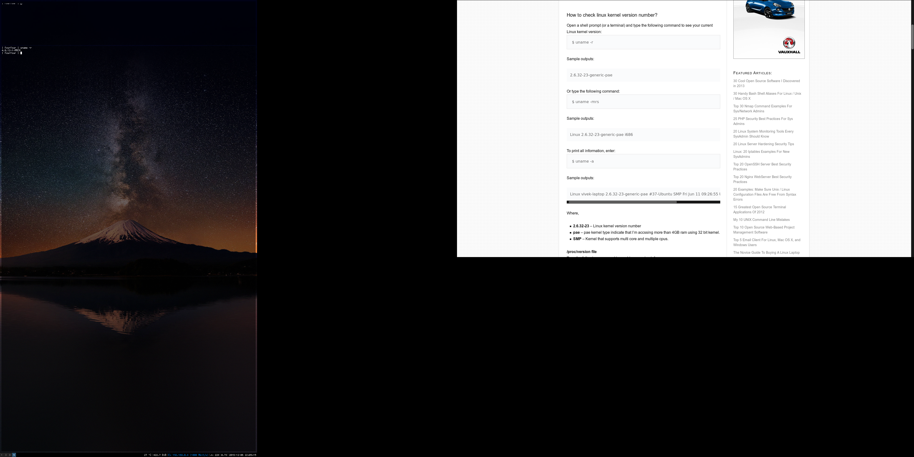

# **Unit 29 - Installing and upgrading software**

> Assignment 2 - Know how to prepare for a software installation or upgrade 

_Daniel Easteal_

Contents page 

* Introduction
 
* P3 - Plan an installation and upgrade
 
* P4 - Record and complete a software installation
 
* P5 - record and complete a software upgrade
 
* P6 - explain the importance of the user acceptance process
 
* M3 - Design and implement a procedure to preserve data integrity during an upgrade
 
* M4 - design a procedure to back out of software upgrades
 
* D1 - Justify a particular installation or upgrade
 
* Conclusion
 
* Bibliography

## Introduction

In this assignment I will be going through the steps and processes that are required to install and upgrade software on a machine. For this I will be planning and recording the installation of software onto the machine as well as explaining how the customer acceptance process is important and how this can be made better. Finally I will be creating a procedure that I will use to backup all of the information and data as well as justifying why I have upgraded the software that I have. One important thing to note here is that I will be installing the software and upgrades into a Linux system and as such I will be using the command line to do so so the process may not look the same, but I will explain it as I go through. 

## P3 - Plan an installation and upgrade
 
In this section I will be going through and installing some software onto my desktop, for this I will also talk about different aspects for the installation, and these are:

* Planning 
* testing 
* Delivery 
* shipping
* storage
* software specs 
* communication
* logs
* security
* confidentially
* contractual requirements

Furthermore, the software that I will be installing is Libre office. This is an office quite similar to Microsoft office, but is available for free and has much of the functionality. Finally the upgrade that I will be doing will be just some general software that is installed on my computer.

 
## P4 - Record and complete a software installation

In this section I will actually be going through and installing Libre office on to my desktop. The way that I will be doing this is through the use of the command line updating tool for my Linux type: arch Linux. The way that updating work is Linux is that a remote file server contains all the software, and the computer downloads and unzips them to install them. This basically puts all of the software that you have on your computer into one system that sets it all up for you. The way that i do this is: ***pacman -S software_name***. Pacman is the name for the PACage MANager which is the process that unifies the software and actually makes it work on my computer. The -S on the end tells the package manager to sync the software with the software on the file servers, this will then download the software and then install it on my computer. So basically this is how I will be installing the software on my machine as it is very simple to do and explain, with the added bonus that this will also download all the other software that the program needs as well, you will see all this in the images below. Finally the software_name is the name of the software that you want to install. 
 
## P5 - record and complete a software upgrade

In this section I will be going through and upgrading the operating system on my computer. When I say this I mean that I will be updating Linux as a new version has been released and is available for my computer. This process is very similar to the previous example as I will also be using the command line to do this with.

To start off with, what actually is the Linux that I will be upgrading and how will I actually upgrade it. Put simply, Linux is the basic operating system that controls and organises everything that is on my computer and this is run as a process that is constantly running in the background. When I am updating this I am changing the code that that will be running. And the command that i will use for this is: ***pacman -Syu*** Again, the pacman part is the package manager that sorts this all out. But the -Syu part in this case will check all of the software in my machine and check it it has been flagged for an update, if so then it will sync with the file servers and download the new parts of the software and install it for you. 

 
## P6 - explain the importance of the user acceptance process
 
## M3 - Design and implement a procedure to preserve data integrity during an upgrade
 
## M4 - design a procedure to back out of software upgrades
 
## D1 - Justify a particular installation or upgrade

Conclusion - 

Bibliography - 

## Bibliography

