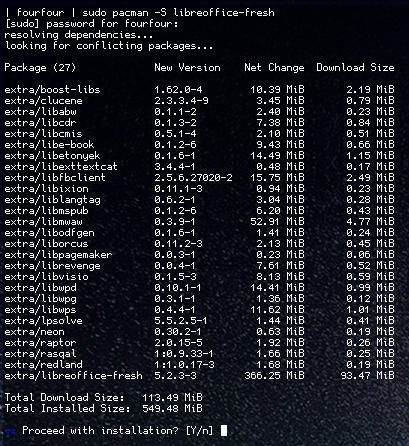

# **Unit 29 - Installing and upgrading software**

> Assignment 2 - Know how to prepare for a software installation or upgrade 

_Daniel Easteal_

Contents page 

* Introduction
 
* P3 - Plan an installation and upgrade
 
* P4 - Record and complete a software installation
 
* P5 - record and complete a software upgrade
 
* P6 - explain the importance of the user acceptance process
 
* M3 - Design and implement a procedure to preserve data integrity during an upgrade
 
* M4 - design a procedure to back out of software upgrades
 
* D1 - Justify a particular installation or upgrade
 
* Conclusion
 
* Bibliography

## Introduction

In this assignment I will be going through the steps and processes that are required to install and upgrade software on a machine. For this I will be planning and recording the installation of software onto the machine as well as explaining how the customer acceptance process is important and how this can be made better. Finally I will be creating a procedure that I will use to backup all of the information and data as well as justifying why I have upgraded the software that I have. One important thing to note here is that I will be installing the software and upgrades into a Linux system and as such I will be using the command line to do so so the process may not look the same, but I will explain it as I go through. 

## P3 - Plan an installation and upgrade
 
In this section I will be going through and explaining the planning procedures that must be required before you install or upgrade any software on a computer system. 

* Planning 
* Testing 
* Delivery 
* Shipping
* Storage
* Software specs 
* Communication
* Logs
* Security
* Confidentially
* Contractual requirements

###  Planning 

When installing or upgrading software you will need to plan out exactly what you are going to do and you are going to do it and this requires planning. Due to the fact that every system that you will be using is different there will be a need to get as much information about a system as you can before you actually go to install the software onto it. In most cases this will work fine, but occasionally the software that you are installing might not actually work and there could be massive errors that you get with the software that you will have to fix. These also need to be planned for. If you are installing the software on a system and you did not plan for the software to go bad when you were installing it then you may not know what to do, or your co-workers may not know what to do and in this case a higher level of action is required. This will therefore lead to a person being called when they did not have to and could lead to losses for the company as their at are not always available when they are required to be. However, if there was planning for the installation then the person installing the software would have known what to do in the case of an error and it could have been sorted out quickly and efficiently. 

###  Testing 

Another thing that you should always do if possible when you are installing software is to test the software first to ensure that it actually works and meets the needs of the customer because otherwise they would have no use for it. The best scenario that you can have with this is that you have an exact replica of the customers computer with the all the software and configuration exactly like they have it. In a perfect world this would happen and this would mean that you would be able to install the software on that system to see if it works. It if does not work then you could solve the problem and find a solution for it so that when you actually go to the customers system you know exactly what you need to do to get the installation to work or you can tell the customer with 100% certainty that the software would not work on their system. However this will never happen in practise so you should always try to get the best representation of the customers computer to test the software on. For example, if you have a machine from the same era as the customers then you could install the same operating system as them to see if it will actually install n that machine and if yo need any other software. Or you could get a machine with the same processor to install it on that.... I could go on and on. But you should try to get the closest you can to the customers system to ensure that the software will work on their system and that it will actually do whet they require from it. 

###  Delivery 

Another procedure that will have to be considered when installing software onto a machine is how you are actually going to get the software onto the machine and deliver the working computer software to the customer as that is what they need. For this to happen there will need to be a way that you can either get to the customers computer physically or logically so that you can install the software and ensure that it works. 

###  Shipping

###  Storage

###  Software specs 

###  Communication

###  Logs

###  Security

###  Confidentially

###  Contractual requirements

## P4 - Record and complete a software installation

In this section I will actually be going through and installing Libre office on to my desktop. The way that I will be doing this is through the use of the command line updating tool for my Linux type: arch Linux. The way that updating work on Linux is that a remote file server contains all the software, and the computer downloads and unzips them to install them. This basically puts all of the software that you have on your computer into one system and program that sets it all up for you. The way that I do this is: ***pacman -S software_name***. Pacman is the name for the PACkage MANager which is the process that unifies the software and actually makes it work on my computer. The -S on the end tells the package manager to sync the software with the software on the file servers, this will then download the software and then install it on my computer. So basically this is how I will be installing the software on my machine as it is very simple to do and explain, with the added bonus that this will also download all the other software that the program needs as well, you will see all this in the images below. Penultimately the software_name is the name of the software that you want to install and in this example this is libreoffice-fresh, the fresh in this part indicates that the software is the new version rather than the one for long term support. Finally, the *sudo* that I add to the beginning will tell the computer that I want to run this command as the admin of this computer not just as a standard user, 

To start off with I will type the command ***sudo pacman -S libreoffice-fresh*** into the terminal to tell the computer that I want to install Libre office, and this is the output that I get from that command:

As you can see we get quite a lot of information, but I will explain it line by line. To start off with, the first line that you see here is just the initial command tart I typed in to the terminal to tell the computer that I wanted to install the software. The line below that asks for the sudo password for fourfour, on my machine my username is fourfour and sudo is the way that you elevate a command to be run as the administrator of the machine rather then just the standard user. Its very similar to the User Access Control window you would get on windows when you install program as that asks you for the admin password. Anyway I type in my password and then it carries on. The next line says "resolving dependencies", when installing software a dependency is another piece of software that the software you are installing needs, think of it like a house and a foundation, if you want to install the "house" then you will need to install the "foundation" first so the house is actually stable and works correctly. The resolving part just finds on the file servers where these additional required packages are and then installs them for you as well. After that it goes on to say that it is looking for conflicting packages, these are other pieces of software that are already on your machine, but would get in the way of your current installation, so they would need  to be replaced. For example, lets say that you were building a house and you already had concrete foundations in place for the house in the ground, but when you talk to the builders you realise that you will need steel foundations instead! There for the concrete foundations get in the way and need to be replaced by the correct foundation that will work. This is very similar as you may have the right software installed on your machine, but it does not have the required functionality so you may have to replace it with the software that your new software needs as otherwise they would inflict. After this it then lists the packages (pieces of software) that are going to be downloaded)

As you can see there area a lot of pieces of software that need to be downloaded (27 infect) and only one of those is the software that you want, that is because these are all the dependencies that the software you want to installed needs to ever run at all. Next to the names of all the software you also see the version number of it (useful for when it is an update) as well as the Net change the software will have on the space on your hard drive and the amount that actually needs to be downloaded for that package. The reason tart the disk space and the download size don't match up is because the package manager download the software in a compressed format so to save on download limits and increase speed for just a little bit of decompression time. At the end of the list of all the packages to get installed it then totals up all of the download size and hard drive space that this whole procedure will take up. As you can see this installation will download 113MiB of information and then extract that to take up 549GiB on my hard drive.  Finally it then asks if I actually want to install this software now that it has totalled it all up for me and I just type y or enter to install the software. A few seconds later after the software has been installed this is now what the terminal looks like. 

As you can see, in this image the previous stuff in the terminal stays there and it just carries on putting stuff to the screen about how it is doing the installation. The first new thin g on this is now the Retrieving packages tittle, this lets me know that it is now downloading all of the 27 packages for the software. This is then followed by a list of all the pieces of software as they are being downloaded. As you can see, after the names and version of the package you also get how much overall the process has downloaded as you can see that this number counts up with every package that has been downloaded. Next to that is a list of the internet speed as it downloads all of the packages, this varies a bit as the software may be downloaded from any of the many file servers so it uses this to help optimise where it should download other packages from. To the right if that again you get a running total of how much time the process is taking and in this case the while download only took 12 seconds overall with the final package to be installed taking up 8 of the 12 total seconds as that was by far the biggest package. Next to that is then a bar that would fill up as the download was happening so you could visually see the progress very quickly but because I took this picture after that fact all the bars are filled. Finally the number on the right is a total percentage of all the download and progress of the installation a bit further down as well.  After this you then get a list of all of the things that the software is doing to actually get installed. The first few items in this list check if the software you have downloaded is actually when you meanest to download and that the file server you downloaded it from was not hacked to give you something else. Then it checks if the software all downloaded in one piece and that there are definitely no conflicts with the software and there is defiantly enough hard drive space to extract the software onto. After this it then sets up and installs all of the individual packages and does what it needs to do to get them up and running on the system. Finally at the end of the list it has installed the software successfully and so put me back to the command line where I can carry on with what I was doing. In total this process took about 15-20 seconds in total and after that the software was installed and worked perfectly.  

So as you can see I have shown the installed programs as well as the files that have been saved and downloaded by the computer. Additionally there was no configuration to get through with the installation because it all was all handled by the package manager program and it set up all of the software for me so that it would install correctly. 
 
## P5 - record and complete a software upgrade

In this section I will be going through and upgrading the operating system on my computer. When I say this I mean that I will be updating Linux as a new version has been released and is available for my computer. This process is very similar to the previous example as I will also be using the command line to do this with.

To start off with, what actually is the Linux that I will be upgrading and how will I actually upgrade it. Put simply, Linux is the basic operating system that controls and organises everything that is on my computer and this is run as a process that is constantly running in the background. When I am updating this I am changing the code that that will be running. And the command that I will use for this is: ***pacman -Syu*** Again, the pacman part is the package manager that sorts this all out. But the -Syu part in this case will check all of the software in my machine and check it it has been flagged for an update, if so then it will sync with the file servers and download the new parts of the software and install it for you. 

Finally in addition to this I will be showing the output of the command ***uname -r***. The command will tell me the current version of Linux that I am running so it will be used to show if the upgrade has succeeded or not.

So to start off with here is the current version of the Linux that my computer is running. As you can see it is 4.6.12-1-ARCH, this tells me that I am running Linux version 4.8 and tart I am using the distribution of arch Linux. This is what I will upgrade. Now telling the computer the update command we see that there is an update to the core Linux software, so there is an update to the operating system: 

The first few lines of output from this command show that my system is currently downloading the new lists of all the software that is available via the package manager as well as what versions they are. After that the package manager looked on the software on the computer and saw that the Linux software from the core file server was flagged for an update. But in order to download the software the package manager will  need to check for any additional software that will need to be downloaded in order for the actual installation of the Linux software to work properly, these are called the dependencies. This is became the core software that you are updating depends on these additional software packages to run and work, but in this case there was no additional software that needed to be downloaded so it can just be downloaded by itself. On the same line as the name of the software being updated we can also see the old and the new version that will be installed, as previous command showed the old version of Linux that I an running on this machine now is 4.8.12-1 and that this update will upgrade this software to the new version of 4.8.12-2 as expected. In addition to this it also shows you the total net change that the software will have and that is calculated to be the difference in disk size between the new and the old version, so it will use up 3.33MiB more space on my computer. Finally on that line it shows that the amount of software that will be downloaded and that is 60MiB so I know that it will not take long. On the three lines below that it then goes on to show the summary of the downloading like just explained, this is put in place for when you are updating multiple pieces of software as it will sum those values up for you so you get a total. Finally it then asks if I want to carry on and actually install and upgrade the software rather than just seeing what is to be upgraded. 

At this stage I just type in y or enter and the software will start to download as shown in the image below. 

So here is what the terminal looks like after you have updated the software and as you can see the initial installation question and summary is still there. Directly after the previous picture we see that the package manager instantly starts downloading the packages (software) that needs to be upgraded. And as you can see this is the 60MiB it says it would be and at the internet speed of 12MiB per second we can also see that this took only 5 seconds to complete. The bars at the side were used to display the progress when the actual downloading of the software was happening. The next five lines then go through and check that the software that was downloaded will actually work. It does this by making sure that the software on the computer exactly matches the software that it should be be checking that all the values are in the appropriate places. It then goes ion to check that he software is all in one piece, then it loads it, checks that it is definitely not already installed and that there is enough disk space for it. From here it now installs the software onto the computer. The rest of the lines basically mean that it is setting it all up and regenerating the start-up files to actually run the new software when the computer starts and ensuring that it is all in place. At the end when the installation and upgrade is successful it then says that the creation of they image was a success and puts me back to the terminal.  

At this point however, the system is not upgraded as I actually need to restart the system to have the new version of Linux running and that is what I do...

After a reboot with no differences from normal I start up the terminal and type the same ***uname -r*** command to see what version of Linux I am now running and here is the result. 

As you can see the computer is now running Linux version 4.8.12-**2** ARCH and so the operating system has been updated. All in all this process took no longer than 30 seconds as the longest thing that took place was the rebooting of the computer, but that was really quick at a few seconds like it normally is. 
 
## P6 - explain the importance of the user acceptance process
 
## M3 - Design and implement a procedure to preserve data integrity during an upgrade
 
## M4 - design a procedure to back out of software upgrades
 
## D1 - Justify a particular installation or upgrade

Conclusion - 

Bibliography - 

## Bibliography

